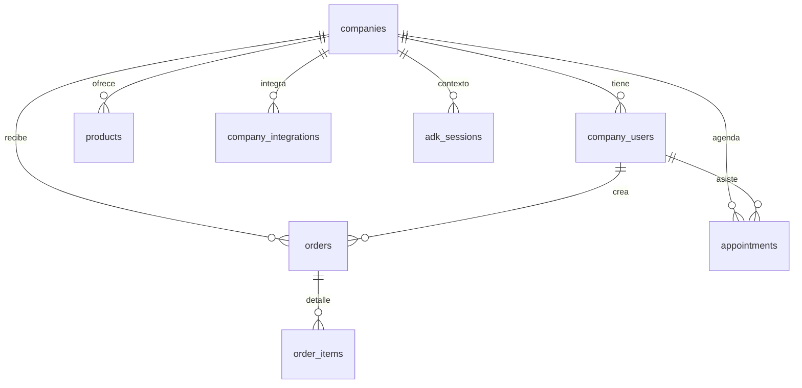
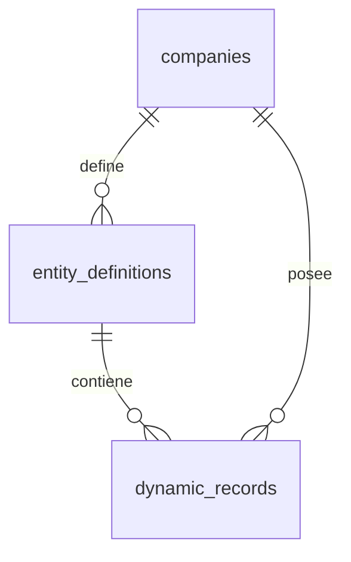

# Base de Datos General

La base usa PostgreSQL (Supabase) con aislamiento lógico por `company_id`. A continuación se muestra un diagrama resumido y las notas de cada entidad.



## Tabla `companies`

- `id`: UUID primario.
- `name`: Nombre visible.
- `whatsapp_phone_id`: **Obligatorio** para multi-tenant; coincide con el `metadata.phone_number_id` que envía Meta.
- `whatsapp_display_phone_number`: Número legible para mostrar en mensajes o logs.
- `whatsapp_admin_phone_ids`: Arreglo de números de teléfono (MSISDN) sanitizados autorizados como administradores por defecto.
- `config`: JSONB con ajustes por compañía (tono, inventario, etc.).
- Timestamps `created_at`, `updated_at`.

## Tabla `company_users`

- `company_id` + `phone` tienen `UNIQUE` para evitar duplicados.
- `role`: Enum `ADMIN` o `CLIENT`.
- `embedding`: Vector pgvector reservado para memoria semántica.
- Se usa para convertir remitentes regulares en usuarios persistentes.

## Tabla `company_integrations`

- `provider`: Enum (`BANK_ECOFUTURO`, `GOOGLE_CALENDAR`, `WALLET_TRON`).
- `encrypted_credentials`: JSONB cifrado con AES.
- `needs_2fa_attention`: Bandera usada para notificar a los admins.
- `updated_at`: se refresca en cada upsert.

## Tabla `products`

- Catálogo maestro por compañía: `sku`, `name`, `price`, `stock_quantity`, `image_url`.

## Tabla `orders`

- `user_id` referencia a `company_users`.
- `status`: Enum (`CART`, `AWAITING_QR`, `QR_SENT`, `VERIFYING_PAYMENT`, `COMPLETED`, `FAILED`, `REQUIRES_2FA`).
- `details`: texto corto usado como referencia bancaria (ej. `REF-XXXX`).
- `metadata`: JSONB extensible.

## Tabla `order_items`

- Relación N:1 con `orders` y `products`.
- `unit_price` y `quantity` almacenan la foto del momento del pedido.

## Tabla `appointments`

- `status`: Enum (`PENDING_SYNC`, `CONFIRMED`, `CANCELLED`, `RESCHEDULED`, `COMPLETED`).
- Índice compuesto + restricción única `appointments_company_slot_unique (company_id, start_time, end_time)` para evitar traslapes dentro de la misma empresa.
- Campos adicionales para sincronización Google: `google_event_id`, `google_html_link`.

## Tabla `adk_sessions`

- `session_id`: Clave `${company_id}:${sender}`.
- `context_data`: JSONB con historial y metadatos usados por Google ADK.

## Reglas Clave

1. **Siempre** filtra por `company_id` al consultar/insertar datos para mantener el aislamiento lógico.
2. El webhook de WhatsApp resuelve la compañía mediante `whatsapp_phone_id`; por eso la combinación `companies.whatsapp_phone_id` + `company_users.phone` define el rol del remitente.
3. Para nuevas compañías, asegúrate de poblar `whatsapp_phone_id`, `whatsapp_admin_phone_ids` (con números de teléfono) y de pasar por el onboarding de Google para habilitar los flujos administrativos.

---

## Universal Schema (Entity-Attribute-Value Modernizado)

El patrón **Universal Schema** permite a las empresas definir estructuras de datos personalizadas sin requerir cambios en el esquema de base de datos. Utiliza JSONB para almacenar datos dinámicos con soporte para privacidad a nivel de entidad.

### Arquitectura



### Tabla `entity_definitions`

Define los **tipos de entidad** que una empresa puede gestionar (Horarios, Menús, Inventarios, etc.).

| Campo | Tipo | Descripción |
|-------|------|-------------|
| `id` | UUID | Identificador único |
| `company_id` | UUID | FK a `companies` |
| `entity_name` | TEXT | Nombre de la entidad (ej: "Horarios", "[PRIV] Costos") |
| `schema_sample` | JSONB | Ejemplo de estructura para referencia |
| `is_public_default` | BOOLEAN | **Crítico:** Si `false`, el Agente IA NO puede leer estos datos |
| `created_at` | TIMESTAMPTZ | Fecha de creación |
| `updated_at` | TIMESTAMPTZ | Última actualización |

**Convención de Privacidad:**
- Entidades que empiezan con `[PRIV]` en el nombre se marcan automáticamente como privadas (`is_public_default = false`).
- El Agente IA aplica un filtro obligatorio `WHERE is_public_default = true` en todas las consultas.

### Tabla `dynamic_records`

Almacena los **registros individuales** de cada entidad usando JSONB flexible.

| Campo | Tipo | Descripción |
|-------|------|-------------|
| `id` | UUID | Identificador único |
| `company_id` | UUID | FK a `companies` (desnormalizado para performance) |
| `entity_definition_id` | UUID | FK a `entity_definitions` |
| `external_row_id` | TEXT | ID externo para sincronización (Google Sheets row ID) |
| `data` | JSONB | Contenido dinámico (ej: `{"dia": "Lunes", "hora": "9am"}`) |
| `search_text` | TSVECTOR | Vector para búsqueda full-text |
| `created_at` | TIMESTAMPTZ | Fecha de creación |
| `updated_at` | TIMESTAMPTZ | Última actualización |

### Índices

- `idx_dynamic_records_data`: Índice GIN sobre `data` para consultas JSONB eficientes.
- `idx_dynamic_records_lookup`: Índice compuesto `(company_id, entity_definition_id)` para lookups rápidos.

### Flujo de Sincronización (Google Sheets → Supabase)

1. **Google Workspace Add-on** detecta cambios en una hoja de cálculo.
2. El Add-on envía el contenido completo de la hoja al webhook `/v1/webhooks/sheets/sync`.
3. El backend identifica si es una entidad pública o privada basándose en el nombre de la hoja.
4. Se actualiza `entity_definitions` con el flag de privacidad correcto.
5. Se ejecuta un **Wipe & Replace** de los `dynamic_records` correspondientes.

### Consulta Segura del Agente IA

El Agente utiliza la tool `query_knowledge_base` que **siempre** filtra datos privados:

```sql
SELECT dr.data
FROM dynamic_records dr
JOIN entity_definitions ed ON dr.entity_definition_id = ed.id
WHERE ed.company_id = $1
  AND ed.entity_name ILIKE '%' || $2 || '%'
  AND ed.is_public_default = true  -- FILTRO CRÍTICO
  AND dr.data::text ILIKE '%' || $3 || '%'
LIMIT 10;
```

### Row Level Security (RLS)

Ambas tablas tienen RLS habilitado para asegurar aislamiento multi-tenant a nivel de base de datos.
