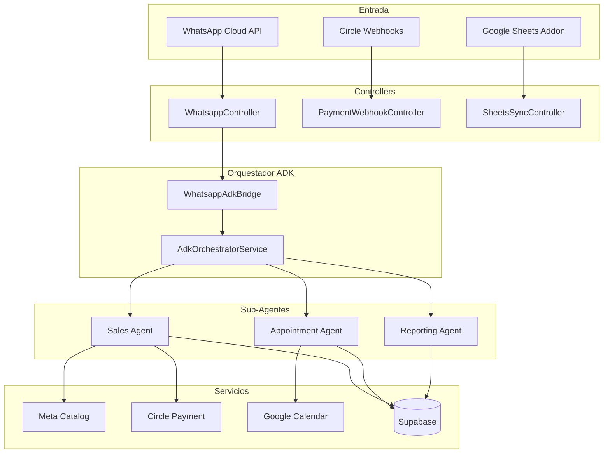
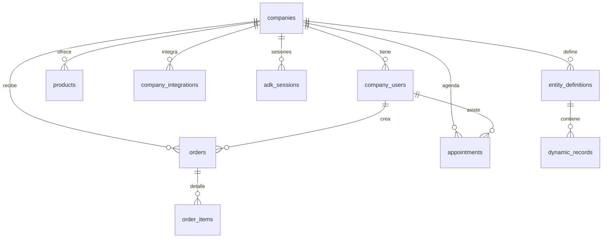
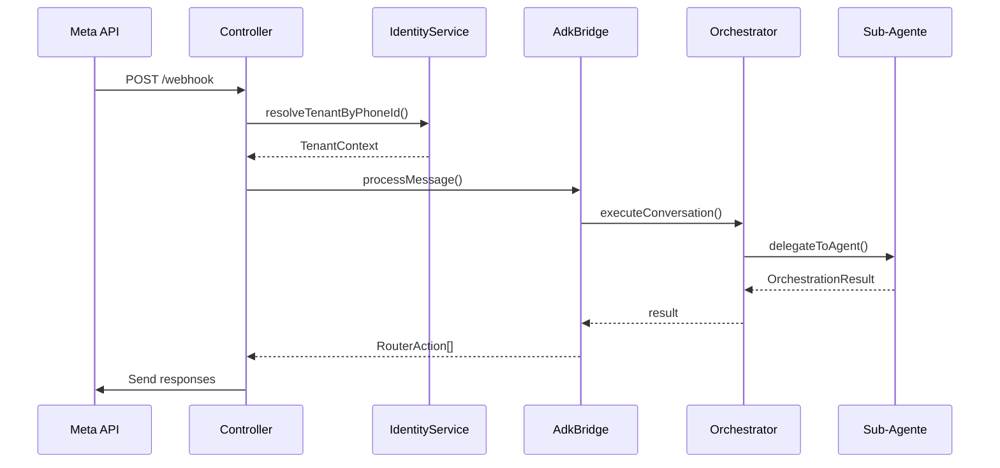
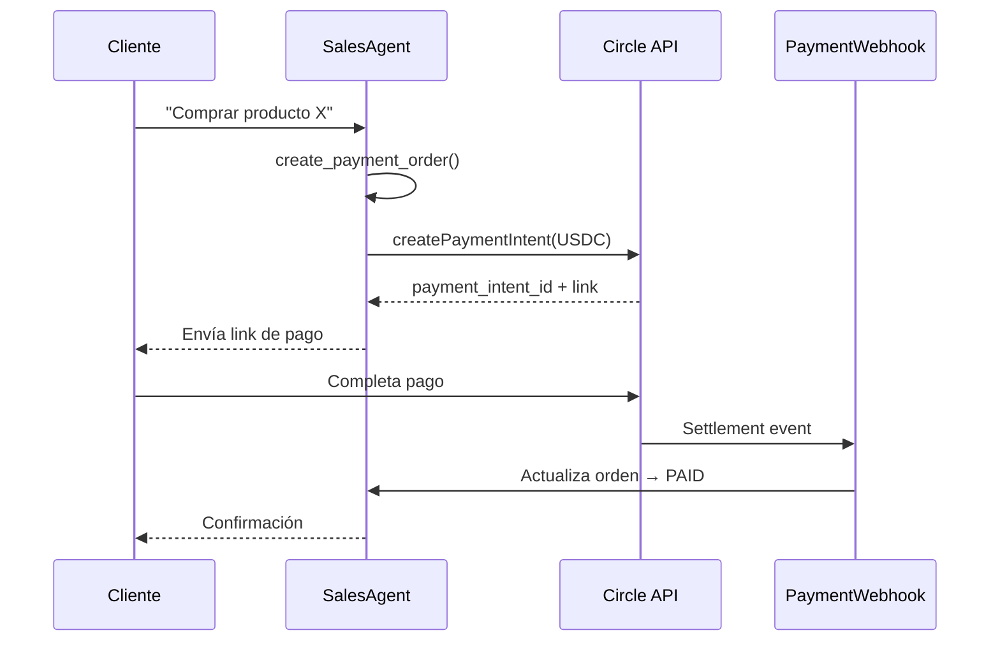
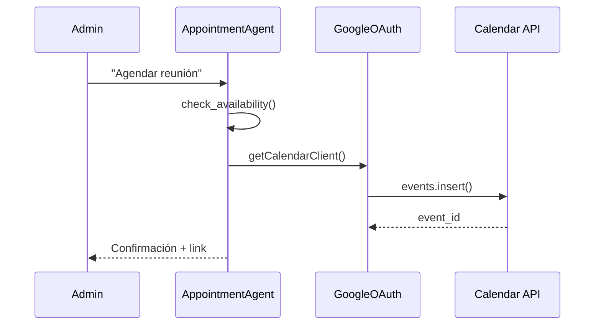

# Documentación OptSMS Backend

<div align="center">


**Backend multi-tenant para WhatsApp Business con IA conversacional**

[Quick Start](#quick-start) • [Arquitectura](#arquitectura) • [API Docs](#documentación-api) • [Database](#base-de-datos)

</div>

---

## Tabla de Contenido

- [Visión General](#visión-general)
- [Stack Tecnológico](#stack-tecnológico)
- [Quick Start](#quick-start)
- [Arquitectura](#arquitectura)
- [Componentes del Sistema](#componentes-del-sistema)
- [Base de Datos](#base-de-datos)
- [Flujos Principales](#flujos-principales)
- [Documentación API](#documentación-api)
- [Integraciones](#integraciones)
- [Deployment](#deployment)
- [Troubleshooting](#troubleshooting)
- [Contributing](#contributing)

---

## Visión General

Sistema backend multi-tenant que permite a empresas gestionar comunicaciones de WhatsApp Business mediante agentes de IA conversacional. Utiliza el patrón de **múltiples agentes especializados** con Google ADK y Gemini para:

- **Ventas**: Búsqueda de productos, generación de órdenes, pagos con Circle USDC
- **Citas**: Agendamiento inteligente con sincronización a Google Calendar
- **Reportes**: Métricas y análisis (solo para administradores)
- **Knowledge Base**: Consulta dinámica de datos desde Google Sheets

### Características Clave

- **Multi-tenant**: Aislamiento por `company_id` con `phone_number_id` dedicado  
- **Multi-agente**: Orquestador + 3 sub-agentes especializados con Google ADK  
- **Pagos USDC**: Integración con Circle para stablecoins  
- **Meta Catalog**: Sincronización bidireccional de productos  
- **Google Calendar**: OAuth 2.0 para gestión de citas  
- **Google Sheets**: Knowledge base dinámica con privacidad  
- **Session State**: Persistencia en Supabase con variables de contexto  

---

## Stack Tecnológico

### Core Framework
| Tecnología | Versión | Propósito |
|------------|---------|-----------|
| **NestJS** | 11.0.1 | Framework backend con arquitectura modular |
| **TypeScript** | 5.7.3 | Lenguaje principal con tipado estático |
| **Node.js** | 18+ | Runtime JavaScript |

### AI & Agents
| Tecnología | Versión | Propósito |
|------------|---------|-----------|
| **Google ADK** | 0.1.3 | Framework multi-agente con LlmAgent |
| **Gemini** | 2.0-flash | Modelo de lenguaje (configurable a 2.5-flash-lite) |
| **Runner.runAsync()** | - | Streaming de respuestas ADK |

### Database & Storage
| Tecnología | Versión | Propósito |
|------------|---------|-----------|
| **PostgreSQL** | 15 | Base de datos principal (Supabase) |
| **pgbouncer** | - | Connection pooling (puerto 6543) |
| **pgvector** | - | Embeddings semánticos (futuro) |

### Integraciones
| Servicio | Propósito |
|----------|-----------|
| **WhatsApp Cloud API** | v24.0 - Mensajería bidireccional |
| **Circle USDC** | Pagos en stablecoin |
| **Meta Business Catalog** | Sincronización de productos |
| **Google Calendar API** | Agendamiento de citas |
| **Google Sheets API** | Knowledge base dinámica |

### DevOps & Tools
- **Swagger UI**: Documentación interactiva en `/docs`
- **Chokidar**: Hot-reload de `.env`
- **class-validator**: Validación de DTOs
- **AES-256**: Encriptación de credenciales

---

## Quick Start

### Pre-requisitos

```bash
- Node.js 18+
- npm 9+
- Cuenta Supabase
- WhatsApp Business Account
- Google Cloud Project (para ADK/Gemini)
```

### Instalación

```bash
# Clonar repositorio
git clone <repo-url>
cd optsms_backend

# Instalar dependencias
npm install

# Copiar configuración
cp .env.example .env
```

### Configuración Mínima

Editar `.env`:

```bash
# WhatsApp Cloud API
WHATSAPP_API_VERSION=v24.0
WHATSAPP_PHONE_NUMBER_ID=tu_phone_number_id
META_API_TOKEN=tu_meta_access_token
WHATSAPP_VERIFY_TOKEN=tu_verify_token

# Google AI
GOOGLE_GENAI_API_KEY=tu_api_key
GOOGLE_GENAI_MODEL=gemini-2.0-flash

# Supabase (puerto 6543 - pgbouncer)
SUPABASE_DB_HOST=db.xxxx.supabase.co
SUPABASE_DB_PORT=6543
SUPABASE_DB_NAME=postgres
SUPABASE_DB_USER=postgres.xxxx
SUPABASE_DB_PASSWORD=tu_password

# Circle USDC (opcional)
CIRCLE_API_KEY=tu_circle_api_key
CIRCLE_ENVIRONMENT=sandbox
```

### Ejecutar

```bash
# Desarrollo (watch mode)
npm run start:dev

# Producción
npm run build
npm run start:prod
```

### Verificar

- Swagger UI: http://localhost:3000/docs
- Health check: `GET http://localhost:3000/`

---

## Arquitectura

### Diagrama de Alto Nivel



### Patrón Multi-Agente

El sistema usa el **patrón Coordinator** de Google ADK:

1. **AdkOrchestratorService**: Analiza intención y delega
2. **SalesAgentService**: Productos + Pagos + Meta Catalog
3. **AppointmentAgentService**: Citas + Google Calendar
4. **ReportingAgentService**: Métricas (solo admins)

Cada agente es un `LlmAgent` independiente con sus propias `FunctionTools`.

**Documentación detallada**: [ARCHITECTURE.md](./ARCHITECTURE.md)

---

## Componentes del Sistema

### Módulos Principales

| Módulo | Archivo | Responsabilidad |
|--------|---------|-----------------|
| **AppModule** | `src/app.module.ts` | Módulo raíz con ConfigModule + ScheduleModule |
| **WhatsappModule** | `src/whatsapp.module.ts` | Módulo principal con todos los servicios |

### Controllers

| Controller | Endpoint | Descripción |
|------------|----------|-------------|
| `WhatsappController` | `GET/POST /webhook` | Verificación y recepción de mensajes |
| `PaymentWebhookController` | `POST /webhook/payments/*` | Eventos de Circle USDC |
| `GoogleAuthController` | `GET /auth/google/callback` | OAuth 2.0 callback |
| `SheetsSyncController` | `POST /sheets-sync` | Sincronización Google Sheets |
| `PaymentProxyController` | `POST /proxy/payment` | Proxy para pagos Circle |
| `CatalogTestController` | `POST /catalog/test/*` | Testing Meta Catalog (dev only) |

### Servicios Core

| Servicio | Propósito |
|----------|-----------|
| `AdkOrchestratorService` | Orquestador principal con Google ADK |
| `WhatsappAdkBridgeService` | Traduce WhatsApp ↔ ADK messages |
| `AdkSessionService` | Persistencia de sesiones ADK |
| `IdentityService` | Resolución multi-tenant + roles |
| `WhatsappService` | Envío/recepción mensajes WhatsApp |

### Sub-Agentes ADK

| Agente | Tools Disponibles | Roles |
|--------|-------------------|-------|
| `SalesAgentService` | `search_products`, `get_product_info`, `create_payment_order`, `check_payment_status`, `sync_inventory_to_meta`, `sync_inventory_from_meta` | Admin + Client |
| `AppointmentAgentService` | `check_availability`, `create_appointment`, `cancel_appointment`, `list_appointments` | Admin + Client |
| `ReportingAgentService` | `get_sales_metrics`, `get_appointment_stats`, `query_dynamic_data`, `generate_executive_report` | **Solo Admin** |

### Integraciones

| Servicio | Integración | Descripción |
|----------|-------------|-------------|
| `MetaCatalogService` | Meta Business Catalog API | Sync bidireccional de productos (batch 50 items) |
| `PaymentClientService` | Circle USDC API | Payment intents + settlements |
| `GoogleOauthService` | Google Calendar API | OAuth 2.0 + refresh tokens |
| `SheetsSyncService` | Google Sheets API | Knowledge base dinámica (Wipe & Replace) |
| `GeminiService` | Google Gemini AI | Wrapper para modelos de lenguaje |

### Servicios Auxiliares

| Servicio | Propósito |
|----------|-----------|
| `SupabaseService` | Pool PostgreSQL con pgbouncer |
| `EncryptionService` | AES-256 para tokens sensibles |
| `SanitizationService` | Remoción de PII antes de IA |
| `OnboardingService` | Guía OAuth para admins |
| `OrdersSyncService` | Persistencia de órdenes |
| `PinataService` | IPFS storage (opcional) |

**Detalle completo**: [FILES_AND_FOLDERS.md](./FILES_AND_FOLDERS.md)

---

## Base de Datos

### Esquema PostgreSQL (Supabase)



### Tablas Principales

| Tabla | Propósito | Constraint Clave |
|-------|-----------|------------------|
| `companies` | Datos de empresas | `whatsapp_phone_id` UNIQUE |
| `company_users` | Usuarios (admins/clients) | UNIQUE(`company_id`, `phone`) |
| `company_integrations` | Credenciales encriptadas | - |
| `products` | Catálogo de productos | Full-text index |
| `orders` | Órdenes de compra | Estados de pago Circle |
| `order_items` | Detalle de órdenes | FK a orders + products |
| `appointments` | Citas agendadas | UNIQUE(`company_id`, `start_time`, `end_time`) |
| `adk_sessions` | Sesiones ADK | PK: `${companyId}:${userPhone}` |
| `entity_definitions` | Tipos de entidad dinámicos | `is_public_default` para privacidad |
| `dynamic_records` | Datos JSONB de Sheets | GIN index sobre `data` |

### Estados de Órdenes

- `CART` → Productos seleccionados
- `PENDING_PAYMENT` → Payment intent creado en Circle
- `PAID` → Settlement confirmado
- `COMPLETED` → Orden finalizada
- `FAILED` → Pago falló

### Roles de Usuario

- `ADMIN` → Acceso completo + configuración
- `CLIENT` → Solo ventas y citas

**Documentación completa**: [DATABASE.md](./db/DATABASE.md)

---

## Flujos Principales

### 1. Mensaje Entrante WhatsApp



### 2. Pago con Circle USDC



### 3. Cita con Google Calendar



**Documentación detallada**: [PROGRAM_FLOWS.md](./PROGRAM_FLOWS.md)

---

## Documentación API

### Swagger UI

Disponible en: **http://localhost:3000/docs**

### Endpoints Principales

#### WhatsApp

```http
GET  /webhook?hub.mode=subscribe&hub.verify_token=...
POST /webhook
```

#### Pagos Circle

```http
POST /webhook/payments/result
POST /webhook/payment/confirm
POST /proxy/payment
```

#### Google OAuth

```http
GET /auth/google/callback?code=...&state=...
```

#### Google Sheets

```http
POST /sheets-sync
```

#### Meta Catalog (Testing)

```http
POST /catalog/test/sync-to-meta
POST /catalog/test/sync-from-meta
```

### DTOs Principales

| DTO | Uso |
|-----|-----|
| `WhatsAppWebhookModels` | Webhooks de Meta |
| `SendTextMessageDto` | Envío de texto |
| `SendImageMessageDto` | Envío de imágenes |
| `SendTemplateMessageDto` | Templates aprobados |
| `PaymentWebhookDto` | Eventos Circle |
| `SheetsSyncPayloadDto` | Sincronización Sheets |
| `MetaBatchRequest` | Batch productos Meta |

---

## Integraciones

### WhatsApp Cloud API

**Versión**: v24.0  
**Endpoint**: `https://graph.facebook.com/v24.0`

**Configuración requerida**:
- Business Account verificado
- App de Meta con permisos `whatsapp_business_messaging`
- Webhook configurado apuntando a `/webhook`

**Variables de entorno**:
```bash
WHATSAPP_API_VERSION=v24.0
WHATSAPP_PHONE_NUMBER_ID=123456789012345
META_API_TOKEN=EAAxxxxx
WHATSAPP_VERIFY_TOKEN=tu_token_secreto
```

### Circle USDC

**Sandbox**: `https://api-sandbox.circle.com`  
**Production**: `https://api.circle.com`

**Flujo de pago**:
1. `POST /v1/paymentIntents` → Crea intent
2. Cliente completa pago en link generado
3. Circle envía webhook a `/webhook/payments/result`
4. Backend actualiza orden a `PAID`

**Variables de entorno**:
```bash
CIRCLE_API_KEY=tu_api_key
CIRCLE_ENVIRONMENT=sandbox
```

### Meta Business Catalog

**API**: Graph API v24.0  
**Endpoint**: `/catalog/{catalog_id}/items`

**Auto-sync al iniciar**:
```bash
CATALOG_SYNC_ON_STARTUP=true
```

**Batch Operations**: Lotes de 50 productos

### Google Calendar

**OAuth 2.0 Scopes**:
- `https://www.googleapis.com/auth/calendar`
- `https://www.googleapis.com/auth/calendar.events`

**Flujo**:
1. Admin solicita integración
2. `OnboardingService` genera URL OAuth
3. Usuario autoriza
4. Callback guarda tokens encriptados (AES-256)
5. `GoogleOauthService` refresca tokens automáticamente

**Variables de entorno**:
```bash
GOOGLE_OAUTH_CLIENT_ID=xxx.apps.googleusercontent.com
GOOGLE_OAUTH_CLIENT_SECRET=GOCSPX-xxx
GOOGLE_OAUTH_REDIRECT_URI=https://tu-dominio/auth/google/callback
GOOGLE_OAUTH_ENCRYPTION_KEY=clave_32_caracteres_base64
```

### Google Sheets (Knowledge Base)

**Workspace Add-on**: `google-addon/`

**Estrategia Wipe & Replace**:
1. Add-on detecta cambios en hoja
2. POST `/sheets-sync` con datos completos
3. Backend elimina registros antiguos
4. Inserta nuevos datos en `dynamic_records`

**Privacidad**:
- Hojas con `[PRIV]` en nombre → `is_public_default = false`
- Tool `query_dynamic_data` filtra solo datos públicos

---

## Deployment

### Variables de Entorno Críticas

```bash
# === CORE ===
NODE_ENV=production
PORT=3000

# === DATABASE ===
SUPABASE_DB_HOST=db.xxx.supabase.co
SUPABASE_DB_PORT=6543  # pgbouncer
SUPABASE_DB_NAME=postgres
SUPABASE_DB_USER=postgres.xxx
SUPABASE_DB_PASSWORD=xxx
SUPABASE_DB_SSL=true

# === WHATSAPP ===
WHATSAPP_API_VERSION=v24.0
WHATSAPP_PHONE_NUMBER_ID=123456789012345
META_API_TOKEN=EAAxxxxx
WHATSAPP_VERIFY_TOKEN=tu_token

# === GOOGLE AI ===
GOOGLE_GENAI_API_KEY=AIzaxxxxx
GOOGLE_GENAI_MODEL=gemini-2.0-flash
# O para Vertex AI:
GOOGLE_GENAI_USE_VERTEXAI=true
GOOGLE_CLOUD_PROJECT=tu-proyecto
GOOGLE_CLOUD_LOCATION=us-central1

# === CIRCLE ===
CIRCLE_API_KEY=xxx
CIRCLE_ENVIRONMENT=production

# === GOOGLE OAUTH ===
GOOGLE_OAUTH_CLIENT_ID=xxx.apps.googleusercontent.com
GOOGLE_OAUTH_CLIENT_SECRET=GOCSPX-xxx
GOOGLE_OAUTH_REDIRECT_URI=https://tu-dominio/auth/google/callback
GOOGLE_OAUTH_ENCRYPTION_KEY=base64_32_caracteres

# === FEATURES ===
CATALOG_SYNC_ON_STARTUP=true
```

### Build & Deploy

```bash
# Build
npm run build

# Iniciar producción
npm run start:prod

# Con PM2
pm2 start dist/main.js --name optsms-backend

# Docker
docker build -t optsms-backend .
docker run -p 3000:3000 --env-file .env optsms-backend
```

### Health Checks

```bash
# Básico
curl http://localhost:3000/

# Swagger
curl http://localhost:3000/docs
```

---

## Troubleshooting

### Problema: "Orchestrator en modo fallback"

**Causa**: `GOOGLE_GENAI_API_KEY` no configurado

**Solución**:
```bash
# Verificar variable
echo $GOOGLE_GENAI_API_KEY

# Configurar en .env
GOOGLE_GENAI_API_KEY=AIzaxxxxx
```

### Problema: "Pool connection error (Supabase)"

**Causa**: Puerto incorrecto o SSL mal configurado

**Solución**:
```bash
# Usar puerto 6543 (pgbouncer)
SUPABASE_DB_PORT=6543

# Habilitar SSL
SUPABASE_DB_SSL=true

# Para desarrollo local con certificados autofirmados
SUPABASE_DB_ALLOW_SELF_SIGNED=true
```

### Problema: "WhatsApp webhook verification failed"

**Causa**: `WHATSAPP_VERIFY_TOKEN` no coincide

**Solución**:
1. Verificar token en `.env`
2. Verificar configuración en Meta Developers
3. Ambos deben ser idénticos

### Problema: "Google Calendar: invalid_grant"

**Causa**: Refresh token expirado

**Solución**:
1. Eliminar integración en `company_integrations`
2. Admin vuelve a autorizar desde WhatsApp
3. Nuevos tokens se guardan automáticamente

### Problema: "Meta Catalog sync failed"

**Causa**: `business_catalog_id` no configurado o permisos faltantes

**Solución**:
```sql
-- Verificar catalog_id
SELECT config->'business_catalog_id' FROM companies WHERE id = 'xxx';

-- Configurar
UPDATE companies 
SET config = jsonb_set(config, '{business_catalog_id}', '"123456789"')
WHERE id = 'xxx';
```

### Problema: "Circle payment webhook not received"

**Causa**: Webhook URL no configurada en Circle dashboard

**Solución**:
1. Ir a Circle Dashboard → Webhooks
2. Configurar: `https://tu-dominio/webhook/payments/result`
3. Eventos: `payment.succeeded`, `payment.failed`

---

## Contributing

### Estructura de Archivos

```
src/
├── main.ts                    # Bootstrap
├── app.module.ts              # Módulo raíz
├── whatsapp.module.ts         # Módulo principal
├── controllers/               # Endpoints
├── dto/                       # Validación de datos
├── services/
│   ├── agents/               # Sistema ADK
│   │   ├── adk-orchestrator.service.ts
│   │   ├── whatsapp-adk-bridge.service.ts
│   │   ├── session/          # Persistencia sesiones
│   │   ├── subagents/        # 3 agentes especializados
│   │   ├── tools/            # FunctionTools de ADK
│   │   └── types/            # Types ADK
│   ├── database/             # Supabase pool
│   ├── payments/             # Circle USDC
│   ├── meta/whatsapp/        # Meta Catalog
│   ├── google/               # OAuth Calendar
│   ├── gemini/               # Gemini wrapper
│   ├── sheets-sync/          # Google Sheets
│   ├── whatsapp/             # WhatsApp service
│   ├── identity/             # Multi-tenant
│   ├── encryption/           # AES-256
│   ├── sanitization/         # PII removal
│   └── ...
└── types/                    # Interfaces globales
```

### Agregar Nuevo Tool al Agente

1. Definir tool en `src/services/agents/tools/`:

```typescript
// src/services/agents/tools/mi-nuevo.tools.ts
import { FunctionTool } from '@google/adk';

export const miNuevoTool = new FunctionTool({
  name: 'mi_nuevo_tool',
  description: 'Descripción clara para Gemini',
  parameters: {
    type: 'object',
    properties: {
      param1: { type: 'string', description: '...' },
    },
    required: ['param1'],
  },
});
```

2. Implementar handler en sub-agente:

```typescript
// src/services/agents/subagents/sales-agent.service.ts
private async handleMiNuevoTool(params: any): Promise<any> {
  // Lógica aquí
  return { resultado: '...' };
}
```

3. Registrar tool en agente:

```typescript
this.agent = new LlmAgent({
  model: this.model,
  tools: [miNuevoTool, ...otrosTools],
  // ...
});
```

### Agregar Nueva Integración

1. Crear servicio en `src/services/`:

```typescript
@Injectable()
export class MiIntegracionService {
  // Implementación
}
```

2. Registrar en `whatsapp.module.ts`:

```typescript
@Module({
  providers: [
    // ...
    MiIntegracionService,
  ],
})
```

3. Agregar variables de entorno en `.env.example`

4. Documentar en este archivo

### Testing

```bash
# Unit tests
npm run test

# E2E tests
npm run test:e2e

# Coverage
npm run test:cov
```

### Lint & Format

```bash
# Lint
npm run lint

# Format
npm run format
```

---

## Documentación Adicional

| Documento | Descripción |
|-----------|-------------|
| [ARCHITECTURE.md](./ARCHITECTURE.md) | Arquitectura detallada del sistema con diagramas Mermaid |
| [DATABASE.md](./db/DATABASE.md) | Esquema completo de base de datos con todas las tablas |
| [FILES_AND_FOLDERS.md](./FILES_AND_FOLDERS.md) | Catálogo exhaustivo de todos los archivos del proyecto |
| [PROGRAM_FLOWS.md](./PROGRAM_FLOWS.md) | Flujos principales y casos de uso con diagramas |
| [README.md](../../README.md) | Quick start y comandos básicos |

---

## Changelog

### Versión Actual (Enero 2026)

**Stack Principal**:
- NestJS 11.0.1
- Google ADK 0.1.3
- Gemini 2.0-flash
- Circle USDC API
- PostgreSQL 15 (Supabase)

**Sistema Multi-Agente**:
- AdkOrchestratorService (Coordinator pattern)
- 3 Sub-agentes especializados con FunctionTools
- Session persistence en Supabase

**Integraciones Activas**:
- WhatsApp Cloud API v24.0
- Circle USDC (reemplaza x402/Avalanche)
- Meta Business Catalog (sync bidireccional)
- Google Calendar (OAuth 2.0)
- Google Sheets (knowledge base dinámica)


---

## Soporte

Para problemas o preguntas:

1. Revisar [Troubleshooting](#troubleshooting)
2. Consultar documentación específica en `.github/docs/`
3. Verificar logs del servidor
4. Consultar Swagger UI para endpoints

---

<div align="center">

**OptSMS Backend** - Multi-tenant WhatsApp Business con IA Conversacional

**Stack**: NestJS • TypeScript • Google ADK • Gemini • PostgreSQL • Circle USDC

Última actualización: Enero 2026

</div>
