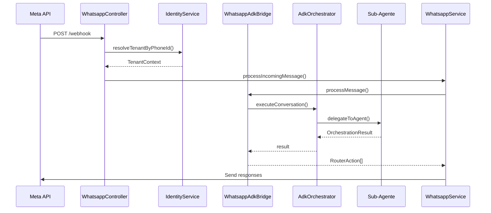
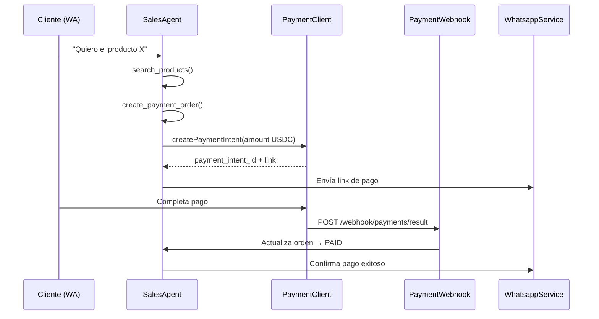
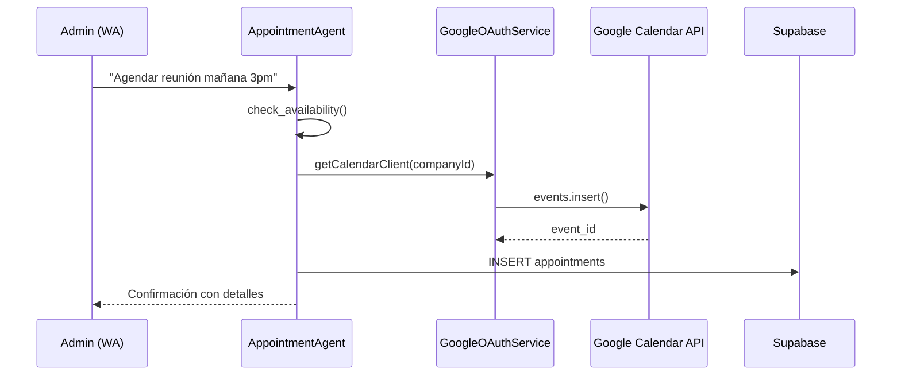
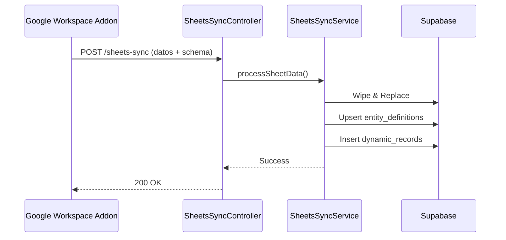

# Flujos del Programa

Flujos principales del sistema multi-tenant con ADK y Circle USDC.

---

## 1. Mensaje Entrante por WhatsApp



**Pasos clave:**
1. Meta envía webhook con `phone_number_id` del tenant
2. `IdentityService` resuelve empresa y rol (admin/client)
3. `WhatsappAdkBridge` traduce mensaje → `AgentMessageContext`
4. `AdkOrchestrator` analiza intención y delega a sub-agente especializado
5. Sub-agente ejecuta tools (productos, pagos, citas, reportes)
6. Respuestas se envían desde el `phone_number_id` del tenant

**Casos de prueba:**
- Admin con OAuth no configurado → recibe URL de configuración
- Cliente nuevo → auto-registro en `company_users`
- Tenant desconocido → log warning, descarta mensaje
- Intención no detectada → respuesta natural usando perfil de empresa

---

## 2. Flujo de Venta con Circle USDC



**Estados de orden:**
- `CART` → Productos seleccionados
- `PENDING_PAYMENT` → Payment intent creado
- `PAID` → Settlement confirmado
- `COMPLETED` → Orden finalizada

**Validaciones:**
- Payment intent se crea con USDC en Circle API
- Webhook usa `companyId` para resolver tenant correcto
- Cliente recibe confirmación desde número del tenant
- Admins pueden ver métricas con `ReportingAgent`

---

## 3. Citas con Google Calendar (Admin)



**Requisitos:**
- OAuth debe estar configurado en `company_integrations`
- Solo admins pueden crear/cancelar citas
- Clientes pueden ver disponibilidad y solicitar
- Slots se calculan dinámicamente según horario de empresa

**Onboarding OAuth:**
1. Admin envía mensaje relacionado a calendario
2. `OnboardingService` detecta integración faltante
3. Genera URL OAuth y la envía
4. Usuario autoriza → callback guarda tokens encriptados
5. Próximo mensaje ya puede usar Calendar API

---

## 4. Meta Catalog Sync

**Auto-sync al iniciar:**
```typescript
// En WhatsappModule
async onApplicationBootstrap() {
  if (process.env.CATALOG_SYNC_ON_STARTUP === 'true') {
    await this.metaCatalog.syncAllCompanies();
  }
}
```

**Flujo bidireccional:**
- `products` (Supabase) → Meta Business Catalog (Batch API 50 items)
- Meta Catalog → `products` (cuando se edita desde Facebook)

**Tools disponibles:**
- `sync_inventory_to_meta` - Sube productos a Meta
- `sync_inventory_from_meta` - Trae productos de Meta
- `search_products` - Busca en tabla local
- `get_product_info` - Detalles de un producto

---

## 5. Google Sheets Sync (Knowledge Base)



**Estrategia Wipe & Replace:**
1. Elimina registros antiguos de `dynamic_records` para ese `entity_id`
2. Inserta nuevos registros en batch
3. Actualiza schema en `entity_definitions`

**Uso en agentes:**
- `query_dynamic_data` tool consulta estos datos
- Responde preguntas sobre inventarios, precios, horarios dinámicos
- Datos se marcan como públicos/privados según checkbox del addon

---

## Notas de Testing

**Multi-tenancy:**
- Cada empresa usa su propio `phone_number_id`
- Mensajes se envían/reciben desde número correcto
- Sesiones ADK aisladas por `${companyId}:${userPhone}`

**Roles:**
- `ROLE_ADMIN` → Todos los tools + configuración
- `ROLE_CLIENT` → Solo ventas, citas (limitado)

**ADK Sessions:**
- Variables de contexto: `app:companyName`, `user:role`, `user:name`
- Persistencia en tabla `adk_sessions`
- InMemorySessionService sincroniza con Supabase

---

**Última actualización**: Enero 2026  
**Stack**: ADK 0.1.3 + Gemini 2.0-flash + Circle USDC
