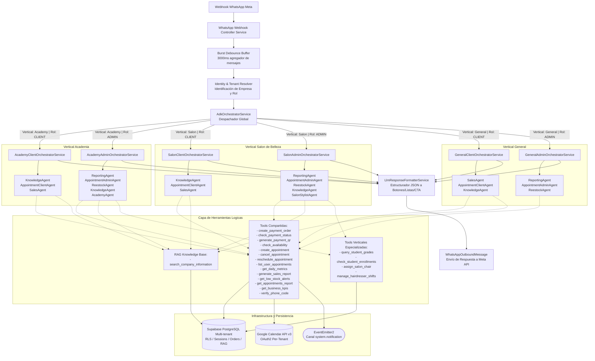
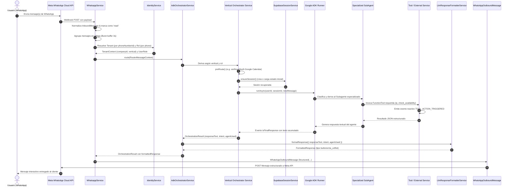

# Arquitectura del Sistema Agéntico de Optus

Este documento describe la arquitectura global del sistema agéntico multi-tenant de Optus, basado en **Google Agent Development Kit (ADK)** y **NestJS**. Explica el flujo de información de extremo a extremo, desde la recepción de eventos por WhatsApp hasta la ejecución de subagentes especializados, ejecución de herramientas (tools), persistencia de contexto y formateo estructurado de respuestas.

---

## 1. Índice de Documentación Técnica Agéntica

Para detalles exhaustivos de cada componente de la arquitectura agéntica, consulta los siguientes documentos dedicados:

- **[Flujo General del Sistema Agéntico (este documento)](file:///.github/docs/ai/architechture.md)**: Visión global, enrutamiento, ciclo de vida del mensaje y diagramas end-to-end.
- **[Arquitectura de Agentes de Orquestación](file:///.github/docs/ai/orchestrators-architecture.md)**: Detalle técnico de orquestadores, clases base, configs, builders de estado/input, ciclo del Runner y sesiones.
- **[Arquitectura del Código de Subagentes](file:///.github/docs/ai/subagents-architecture.md)**: Detalle del patrón Transient, factories, configs especializadas, instructions, inyección de herramientas e prompts.
- **[Arquitectura de Tools](file:///.github/docs/ai/tools-architecture.md)**: Detalle de diseño de herramientas, integración con ADK `FunctionTool`, Zod, `ToolContext`, eventos reactivos y servicios externos.
- **[Catálogo y Referencia Completa de Tools](file:///.github/docs/ai/tools-reference.md)**: Listado exhaustivo de todas las herramientas, parámetros Zod, tipos, retornos y estado de implementación.

---

## 2. Diagrama de Arquitectura Global

---

## 3. Principios Fundamentales del Diseño Agéntico

1. **Multi-Tenancy Aislado por Diseño**:
   - Cada empresa (tenant) posee un `companyId` único y una configuración vertical específica (`general`, `academy`, `salon`).
   - El estado de la sesión (`SupabaseSessionService`) se almacena asociado a la tupla `(appName:tenantName, userId:phone)`.
   - Las herramientas acceden al `companyId` de forma segura mediante `ToolContext.state.get('app:companyId')`, garantizando que ninguna tool mezcle información entre inquilinos.

2. **Segregación de Responsabilidades por Rol**:
   - **CLIENT (Cliente Final)**: Acceso a agentes informativos (`KnowledgeAgent`), agendamiento de citas propias (`AppointmentClientAgent`) y procesamiento de pagos (`SalesAgent`). No puede ver eventos ajenos ni métricas.
   - **ADMIN (Personal Administrativo)**: Acceso a métricas de negocio (`ReportingAgent`), calendario maestro y cancelaciones globales (`AppointmentAdminAgent`), inventario (`ReestockAgent`) y herramientas verticales operativas (`AcademyAgent`, `SalonStylistAgent`).

3. **Orquestadores Jerárquicos y Subagentes Transitorios**:
   - Los **Orquestadores** son servicios singleton en NestJS (`BaseOrchestratorService`) que ejecutan un agente ADK superior responsable de clasificar intenciones y transferir la conversación al subagente óptimo.
   - Los **Subagentes** se instancian con `Scope.TRANSIENT` para cada orquestador que los requiere, asegurando aislamiento de herramientas e instrucciones.

4. **Desacoplamiento del Canal de Mensajería (Channel-Agnostic)**:
   - El razonamiento del LLM produce texto contextualizado.
   - El servicio `LlmResponseFormatterService` traduce la salida del LLM a un formato JSON neutral de interfaz enriquecida (`buttons`, `cta_url`, `interactive_list`), permitiendo reutilizar los agentes en WhatsApp, SMS, web chat, etc.

5. **Observabilidad Reactiva por Eventos**:
   - Cada acción clave (resolución de tenant, generación de respuesta, invocación de herramientas, creación de órdenes o citas) emite eventos estructurados mediante `EventEmitter2` al canal central `system.notification`, permitiendo analíticas en tiempo real y transmisión SSE.

---

## 4. Ciclo de Vida del Mensaje End-to-End

### Secuencia Cronológica

---

## 5. Matriz de Agentes y Orquestadores por Rol y Vertical

| Vertical | Rol | Orquestador Asignado | Subagentes Disponibles | Tools del Orquestador |
| :--- | :--- | :--- | :--- | :--- |
| **General** | **CLIENT** | `GeneralClientOrchestratorService` | `SalesAgent` `AppointmentClientAgent` `KnowledgeAgent` | `verify_phone_code` |
| **General** | **ADMIN** | `GeneralAdminOrchestratorService` | `ReportingAgent` `AppointmentAdminAgent` `ReestockAgent` | `verify_phone_code` |
| **Academy** | **CLIENT** | `AcademyClientOrchestratorService` | `KnowledgeAgent` `AppointmentClientAgent` `SalesAgent` | `verify_phone_code` |
| **Academy** | **ADMIN** | `AcademyAdminOrchestratorService` | `ReportingAgent` `AppointmentAdminAgent` `ReestockAgent` `KnowledgeAgent` `AcademyAgent` | `verify_phone_code` |
| **Salon** | **CLIENT** | `SalonClientOrchestratorService` | `KnowledgeAgent` `AppointmentClientAgent` `SalesAgent` | `verify_phone_code` |
| **Salon** | **ADMIN** | `SalonAdminOrchestratorService` | `ReportingAgent` `AppointmentAdminAgent` `ReestockAgent` `KnowledgeAgent` `SalonStylistAgent` | `verify_phone_code` |

---

## 6. Variables del Estado de Sesión (`SessionState`)

El estado de la sesión se inicializa mediante `InitialStateBuilder` y se mantiene sincronizado en PostgreSQL (`adk_sessions`) y en memoria:

| Clave | Tipo | Descripción | Ejemplo |
| :--- | :--- | :--- | :--- |
| `user:phone` | `string` | Número telefónico normalizado del emisor | `584121234567` |
| `user:role` | `UserRole` | Rol del usuario (`CLIENT` o `ADMIN`) | `CLIENT` |
| `user:name` | `string?` | Nombre de perfil de WhatsApp | `Juan Perez` |
| `app:companyId` | `string` | UUID identificador de la empresa tenant | `a1b2c3d4-...` |
| `app:companyName` | `string` | Nombre comercial de la empresa | `Academia Futuro` |
| `app:companyConfig` | `Record` | Configuración jsonb personalizada del tenant | `{ "maxAppointmentsPerDay": 10 }` |
| `app:currency` | `string` | Moneda base configurada | `USD` |
| `app:companyTone` | `string` | Tono de comunicación de la marca | `profesional`, `cálido` |
| `app:todayDate` | `string` | Fecha actual en la zona horaria del usuario | `2026-08-18` |
| `app:currentDateTime` | `string` | Fecha y hora actual formateada | `2026-08-18 10:30` |
| `app:timezone` | `string` | Zona horaria del usuario | `America/Caracas` |
| `temp:*` | `any` | Datos temporales de ejecución (no se persisten en BD) | `temp:lastOrderId` |

---

## 7. Próximos Pasos y Extensiones

Para conocer la implementación a nivel de código de cada subsistema:
1. Revisa [orchestrators-architecture.md](file:///.github/docs/ai/orchestrators-architecture.md) para extender nuevos orquestadores o verticales.
2. Revisa [subagents-architecture.md](file:///.github/docs/ai/subagents-architecture.md) para añadir nuevos subagentes con prompts optimizados.
3. Revisa [tools-architecture.md](file:///.github/docs/ai/tools-architecture.md) y [tools-reference.md](file:///.github/docs/ai/tools-reference.md) para implementar o integrar nuevas herramientas con APIs externas o base de datos.
