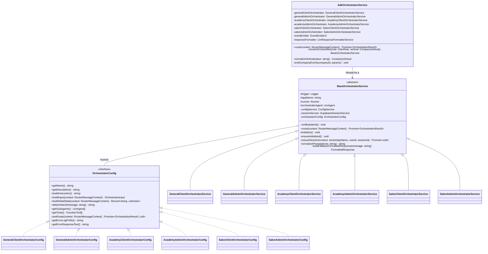

# Arquitectura de Agentes de Orquestación

Este documento detalla la arquitectura de software, jerarquía de clases, interfaces, patrones de diseño y flujo de ejecución de los **Agentes de Orquestación** en el backend de Optus.

---

## 1. Visión General del Subsistema de Orquestación

Los agentes de orquestación constituyen la primera línea de toma de decisiones inteligente en el sistema agéntico. Su responsabilidad principal es recibir el contexto del mensaje entrante, evaluar la intención del usuario, mantener la coherencia conversacional y delegar la ejecución a los subagentes especializados o ejecutar herramientas de orquestación directas (como validación OTP).



---

## 2. Componentes Principales

### 2.1. Despachador Global: `AdkOrchestratorService`
- **Ubicación**: `src/core/adk/orchestrator/adk-orchestrator.service.ts`
- **Patrón**: Dispatcher / Router Front-Controller.
- **Responsabilidades**:
  1. Recibe el `RouterMessageContext` desde la capa de mensajería de WhatsApp.
  2. Normaliza el vertical (`'general'`, `'academy'`, `'salon'`) y el rol (`UserRole.CLIENT` o `UserRole.ADMIN`).
  3. Emite el evento de observabilidad `SystemEventType.TENANT_RESOLVED`.
  4. Resuelve y delega el mensaje al servicio de orquestación correspondiente (`resolveOrchestrator`).
  5. Emite el evento `SystemEventType.LLM_RESPONSE_GENERATED` con métricas de la ejecución.
  6. Si la respuesta no es un bypass como `cta_url`, envía el texto plano al `LlmResponseFormatterService` para transformarlo en una respuesta estructurada multicanal (botones, listas interactivas, etc.).

### 2.2. Clase Base: `BaseOrchestratorService`
- **Ubicación**: `src/core/adk/orchestrator/base/orchestrator.base.ts`
- **Patrón**: Template Method & Lifecycle Manager.
- **Implementa**: `OnModuleInit` de NestJS.
- **Responsabilidades**:
  1. **Inicialización (`onModuleInit` / `initialize`)**: Configura el modelo Gemini (`Gemini` de `@google/adk`), instancia el `LlmAgent` de ADK asociando los subagentes (`getSubAgents()`) y herramientas (`getTools()`), y crea el `Runner` de ADK junto con el `SupabaseSessionService`.
  2. **Pre-Enrutamiento (`preRoute`)**: Permite interceptar la petición antes de invocar al LLM (por ejemplo, validando si el administrador tiene conectada su cuenta de Google Calendar mediante OAuth).
  3. **Manejo de Sesión (`ensureSession`)**: Asegura la existencia de una sesión persistente en Supabase bajo el formato `${tenantAppName}:${userId}` inicializando el estado con `buildInitialState(context)`.
  4. **Ejecución Asíncrona con el Runner**: Ejecuta `runner.runAsync(...)` consumiendo el stream de eventos de ADK, capturando qué agente generó la respuesta (`event.author`) y el texto final (`isFinalResponse(event)`).
  5. **Manejo de Errores y Fallback**: Captura excepciones de Google AI / Supabase y devuelve una respuesta estructurada de contingencia.

---

## 3. Interfaz `OrchestratorConfig`

La interfaz `OrchestratorConfig` desacopla la lógica de ejecución del `BaseOrchestratorService` de la configuración particular de cada vertical y rol:

```typescript
export interface OrchestratorConfig {
  getName(): string;
  getDescription(): string;
  buildInstruction(): string;
  buildInput(context: RouterMessageContext): OrchestratorInput;
  buildInitialState(context: RouterMessageContext): Record<string, unknown>;
  detectIntent(message: string): OrchestrationResult['intent'];
  getSubAgents(): LlmAgent[];
  getTools(): FunctionTool[];
  preRoute?(context: RouterMessageContext): Promise<OrchestrationResult | null>;
  getErrorLogPrefix(): string;
  getErrorResponseText(): string;
}
```

---

## 4. Orquestadores por Vertical y Rol

### 4.1. Vertical General

#### A. Cliente: `GeneralClientOrchestratorService` & `GeneralClientOrchestratorConfig`
- **Nombre**: `general_client_orchestrator`
- **Subagentes**:
  1. `SalesAgent` (`sales_agent`): Pagos y transacciones.
  2. `AppointmentClientAgent` (`appointment_client_agent`): Citas del cliente.
  3. `KnowledgeAgent` (`knowledge_agent`): Información pública de la empresa.
- **Tools Directas**: `verify_phone_code` (Verificación de códigos OTP).
- **Prompt Base**: Se presenta de cara al cliente como un empleado más, priorizando respuestas breves y derivación inteligente.

#### B. Administrador: `GeneralAdminOrchestratorService` & `GeneralAdminOrchestratorConfig`
- **Nombre**: `general_admin_orchestrator`
- **Subagentes**:
  1. `ReportingAgent` (`reporting_agent`): Métricas, reportes y KPIs.
  2. `AppointmentAdminAgent` (`appointment_admin_agent`): Gestión global de citas.
  3. `ReestockAgent` (`reestock_agent`): Reabastecimiento e inventario.
- **Tools Directas**: `verify_phone_code`.
- **Pre-Enrutamiento (`preRoute`)**: Comprueba mediante `OAuthService.checkCredentials(companyId)` si la empresa tiene conectada su cuenta de Google Calendar. Si no está conectada, devuelve inmediatamente un `handleGoogleAccountConnectionRequirement` con botón CTA hacia la URL de autorización.

---

### 4.2. Vertical Academia (`academy`)

#### A. Cliente: `AcademyClientOrchestratorService` & `AcademyClientOrchestratorConfig`
- **Nombre**: `academy_client_orchestrator`
- **Subagentes**:
  1. `KnowledgeAgent`: Información institucional, cursos, materias, horarios y políticas académicas.
  2. `AppointmentClientAgent`: Reservas de asesorías, tutorías o citas académicas.
  3. `SalesAgent`: Pagos de matrículas y mensualidades.
- **Tools Directas**: `verify_phone_code`.

#### B. Administrador: `AcademyAdminOrchestratorService` & `AcademyAdminOrchestratorConfig`
- **Nombre**: `academy_admin_orchestrator`
- **Subagentes**:
  1. `ReportingAgent`: Métricas y KPIs de la institución.
  2. `AppointmentAdminAgent`: Coordinación y calendario interno.
  3. `ReestockAgent`: Insumos y material académico.
  4. `KnowledgeAgent`: Soporte y consultas de políticas.
  5. `AcademyAgent` (`academy_agent`): Operaciones académicas especializadas (`query_student_grades`, `check_student_enrollments`).
- **Tools Directas**: `verify_phone_code`.
- **Pre-Enrutamiento (`preRoute`)**: Valida credenciales de Google OAuth antes de permitir la interacción administrativa.

---

### 4.3. Vertical Salón de Belleza (`salon`)

#### A. Cliente: `SalonClientOrchestratorService` & `SalonClientOrchestratorConfig`
- **Nombre**: `salon_client_orchestrator`
- **Subagentes**:
  1. `KnowledgeAgent`: Catálogo de servicios, precios de referencia y políticas del salón.
  2. `AppointmentClientAgent`: Reservas, cancelaciones y reprogramaciones de citas de belleza.
  3. `SalesAgent`: Cobro de productos capilares/estéticos y servicios.
- **Tools Directas**: `verify_phone_code`.

#### B. Administrador: `SalonAdminOrchestratorService` & `SalonAdminOrchestratorConfig`
- **Nombre**: `salon_admin_orchestrator`
- **Subagentes**:
  1. `ReportingAgent`: Métricas de ventas, ticket promedio y ocupación.
  2. `AppointmentAdminAgent`: Control de agenda del salón.
  3. `ReestockAgent`: Control de productos e insumos de belleza.
  4. `KnowledgeAgent`: Políticas y manuales operativos.
  5. `SalonStylistAgent` (`salon_stylist_agent`): Gestión especializada de sillas y turnos de estilistas (`assign_salon_chair`, `manage_hairdresser_shifts`).
- **Tools Directas**: `verify_phone_code`.
- **Pre-Enrutamiento (`preRoute`)**: Valida credenciales de Google OAuth.

---

## 5. Builders y Esquemas de Entrada/Salida

### 5.1. Esquema de Entrada: `ORCHESTRATOR_INPUT_SCHEMA`
Definido en `src/core/adk/orchestrator/types/orchestrator-io.types.ts` usando Zod y convertido a esquema ADK mediante `zodObjectToSchema`:

```typescript
const OrchestratorInputSchema = z.object({
  message: z.object({
    text: z.string(),
    referredProduct: z
      .object({
        catalogId: z.string(),
        productRetailerId: z.string(),
      })
      .optional(),
  }),
  sender: z.object({
    id: z.string(),
    name: z.string().optional(),
    role: z.string().optional(),
  }),
  tenant: z.object({
    id: z.string(),
    name: z.string(),
    vertical: z.string(),
    config: z.any(),
  }),
});
```

### 5.2. `InputBuilder` (`buildInput`)
- **Ubicación**: `src/core/adk/orchestrator/builders/input.builder.ts`
- Transforma el `RouterMessageContext` en la estructura estandarizada `OrchestratorInput` que consume el LLM como mensaje de entrada en formato JSON serializado.

### 5.3. `InitialStateBuilder` (`buildInitialState`)
- **Ubicación**: `src/core/adk/orchestrator/builders/initial-state.builder.ts`
- Inyecta variables críticas en la sesión de ADK cuando se crea por primera vez:
  - `user:phone`, `user:role`, `user:name`
  - `app:companyId`, `app:companyName`, `app:companyConfig`, `app:currency`, `app:companyTone`
  - `app:todayDate`, `app:currentDateTime`, `app:timezone` (calculados mediante `TimeService` según el código de país del teléfono del usuario).

### 5.4. Helper de Conexión OAuth Google: `handleGoogleAccountConnectionRequirement`
- **Ubicación**: `src/core/adk/orchestrator/helpers/google-account-connection.helper.ts`
- Genera un `OrchestrationResult` con `formattedResponse` de tipo `cta_url`.
- Contiene la URL de redirección obtenida de `oauthService.getAuthUrl(companyId)` y configura el sticker de evento `error_or_unauthorized_action`.

---

## 6. Persistencia de Sesión con Supabase (`SupabaseSessionService`)

El `SupabaseSessionService` extiende `BaseSessionService` de `@google/adk`:

1. **Estructura de la Tabla `adk_sessions`**:
   - `session_id` (`string` PK): Formato `${appName}:${userId}` (ej. `academia_futuro:584121234567`).
   - `company_id` (`uuid` FK): Clave foránea del tenant para aislamiento RLS.
   - `context_data` (`jsonb`): Almacena `{ state: {...}, events: [...] }`.
   - `updated_at` (`timestamptz`): Marca de tiempo de la última interacción.

2. **Aislamiento de Claves Temporales (`stripTempState`)**:
   - Las claves que comienzan con `temp:` (ej. `temp:lastOrderId`) solo existen durante el ciclo de vida en memoria y son eliminadas antes de persistir a PostgreSQL para evitar acumulación de basura en base de datos.

3. **Fallback en Memoria**:
   - Si la base de datos no está disponible o no se configuró `companyId`, el servicio degrada elegantemente a un almacenamiento `Map<string, Session>` en memoria.
