# Arquitectura del Código de Subagentes

Este documento describe con máximo detalle técnico la arquitectura, jerarquía de clases, diseño de configuración, fábricas (factories), interfaces y ciclo de vida de los **Subagentes Especializados** en el backend de Optus.

---

## 1. Visión General de los Subagentes

Los subagentes son instancias de `LlmAgent` de Google ADK altamente especializadas en un dominio funcional acotado (ventas, citas, soporte/conocimiento RAG, analíticas, inventario u operaciones verticales). 

En lugar de construir un modelo monolítico gigante con decenas de herramientas ambiguas, la arquitectura de Optus implementa el **patrón de especialización jerárquica**, donde cada subagente recibe un prompt directivo enfocado y un conjunto restringido y seguro de herramientas (`FunctionTool`).

```mermaid
classDiagram
    class BaseSubAgentConfig {
        <<abstract>>
        +name: string*
        +description: string*
        +errorLabel: string*
        +buildInstruction()* string
        +buildDefinition(tools: FunctionTool[]) SubAgentDefinition
    }

    class SubAgentDefinition {
        <<interface>>
        +name: string
        +description: string
        +instruction: string
        +tools: FunctionTool[]
        +errorLabel: string
        +modelName: string?
    }

    class AdkAgentFactory {
        <<factory>>
        +createGeminiAgent(config: ConfigService, definition: SubAgentDefinition) LlmAgent
    }

    class SalesSubAgentConfig
    class AppointmentClientSubAgentConfig
    class AppointmentAdminSubAgentConfig
    class KnowledgeSubAgentConfig
    class ReportingSubAgentConfig
    class ReestockSubAgentConfig
    class AcademySubAgentConfig
    class SalonSubAgentConfig

    BaseSubAgentConfig <|-- SalesSubAgentConfig
    BaseSubAgentConfig <|-- AppointmentClientSubAgentConfig
    BaseSubAgentConfig <|-- AppointmentAdminSubAgentConfig
    BaseSubAgentConfig <|-- KnowledgeSubAgentConfig
    BaseSubAgentConfig <|-- ReportingSubAgentConfig
    BaseSubAgentConfig <|-- ReestockSubAgentConfig
    BaseSubAgentConfig <|-- AcademySubAgentConfig
    BaseSubAgentConfig <|-- SalonSubAgentConfig

    BaseSubAgentConfig ..> SubAgentDefinition: produce
    AdkAgentFactory ..> SubAgentDefinition: consume
    AdkAgentFactory ..> LlmAgent: instancia

    class SalesAgent {
        +agent: LlmAgent
    }
    class AppointmentClientAgent {
        +agent: LlmAgent
    }
    class AppointmentAdminAgent {
        +agent: LlmAgent
    }
    class KnowledgeAgent {
        +agent: LlmAgent
    }
    class ReportingAgent {
        +agent: LlmAgent
    }
    class ReestockAgent {
        +agent: LlmAgent
    }
    class AcademyAgent {
        +agent: LlmAgent
    }
    class SalonStylistAgent {
        +agent: LlmAgent
    }

    SalesAgent ..> SalesSubAgentConfig: usa
    AppointmentClientAgent ..> AppointmentClientSubAgentConfig: usa
    AppointmentAdminAgent ..> AppointmentAdminSubAgentConfig: usa
    KnowledgeAgent ..> KnowledgeSubAgentConfig: usa
    ReportingAgent ..> ReportingSubAgentConfig: usa
    ReestockAgent ..> ReestockSubAgentConfig: usa
    AcademyAgent ..> AcademySubAgentConfig: usa
    SalonStylistAgent ..> SalonSubAgentConfig: usa

    SalesAgent ..> AdkAgentFactory: invoca
    AppointmentClientAgent ..> AdkAgentFactory: invoca
    AppointmentAdminAgent ..> AdkAgentFactory: invoca
    KnowledgeAgent ..> AdkAgentFactory: invoca
    ReportingAgent ..> AdkAgentFactory: invoca
    ReestockAgent ..> AdkAgentFactory: invoca
    AcademyAgent ..> AdkAgentFactory: invoca
    SalonStylistAgent ..> AdkAgentFactory: invoca
```



---

## 2. Patrón de Fábrica y Definición de Subagentes

### 2.1. Interfaz `SubAgentDefinition`
- **Ubicación**: `src/core/adk/agents/shared/subagent-definition.ts`
- Define la estructura contractual necesaria para instanciar cualquier subagente en ADK:

```typescript
import type { FunctionTool } from '@google/adk';

export interface SubAgentDefinition {
  name: string;
  description: string;
  instruction: string;
  tools: FunctionTool[];
  errorLabel: string;
  modelName?: string;
}
```

### 2.2. Fábrica `createGeminiAgent`
- **Ubicación**: `src/core/adk/agents/shared/adk-agent.factory.ts`
- **Propósito**: Centraliza la instanciación de modelos Gemini y agentes `LlmAgent` de ADK, garantizando configuración uniforme de llaves de API, modelos por defecto (`gemini-2.0-flash`) y manejo de errores.

```typescript
export function createGeminiAgent(
  config: ConfigService,
  definition: SubAgentDefinition,
): LlmAgent {
  const apiKey = config.get<string>('GOOGLE_GENAI_API_KEY', '');
  const modelName =
    definition.modelName ??
    config.get<string>('GOOGLE_GENAI_MODEL', 'gemini-2.0-flash');

  if (!apiKey) {
    throw new Error(`Google AI no configurado para ${definition.errorLabel}`);
  }

  const model = new Gemini({ apiKey, model: modelName });

  return new LlmAgent({
    name: definition.name,
    model,
    instruction: definition.instruction,
    description: definition.description,
    tools: definition.tools,
  });
}
```

### 2.3. Clase Base `BaseSubAgentConfig`
- **Ubicación**: `src/core/adk/agents/shared/subagent-config.base.ts`
- **Propósito**: Plantilla abstracta que estandariza la creación de instrucciones y la construcción del `SubAgentDefinition`:

```typescript
export abstract class BaseSubAgentConfig {
  abstract readonly name: string;
  abstract readonly description: string;
  abstract readonly errorLabel: string;

  abstract buildInstruction(): string;

  buildDefinition(tools: FunctionTool[]): SubAgentDefinition {
    return {
      name: this.name,
      description: this.description,
      instruction: this.buildInstruction(),
      tools,
      errorLabel: this.errorLabel,
    };
  }
}
```

---

## 3. Patrón de Alcance Transitorio en NestJS (`Scope.TRANSIENT`)

Todos los servicios envolventes de subagentes se registran con `@Injectable({ scope: Scope.TRANSIENT })`.

### ¿Por qué `Scope.TRANSIENT`?
1. **Aislamiento de Instancia**: Cada orquestador que inyecta un subagente recibe una instancia dedicada con sus propias referencias de herramientas y estado.
2. **Prevención de Contaminación Cruzada**: Evita que dos orquestadores con diferente configuración de herramientas o estado compartan la misma instancia interna de `LlmAgent`.
3. **Optimización de Memoria**: Las instancias son creadas bajo demanda en el grafo de dependencias de NestJS y se liberan adecuadamente.

---

## 4. Detalle de Clases Envolventes y de Configuración

A continuación se detalla cada subagente del sistema, sus clases asociadas, herramientas vinculadas y directivas de su prompt:

---

### 4.1. `SalesAgent` & `SalesSubAgentConfig`
- **Wrapper**: `src/core/adk/agents/general/sales/sales.agent.ts`
- **Config**: `src/core/adk/agents/general/config/sales.config.ts`
- **Tools**: `create_payment_order`, `check_payment_status`, `generate_payment_qr`, `sync_inventory`.
- **Identificador**: `sales_agent`
- **Descripción**: *"Agente especializado en ventas, catálogo de productos y procesamiento de pagos"*.
- **Instrucción / Prompt**:
  - Rol: Especialista en ventas y pagos para `{app:companyName}`.
  - Tono: `{app:companyTone}`.
  - Contexto: Fecha `{app:todayDate}`, Catálogo `{app:inventoryContext}`.
  - Reglas clave: Verificar siempre stock antes de confirmar, generar QR para pagos y explicar cómo escanearlo, no inventar precios.

---

### 4.2. `AppointmentClientAgent` & `AppointmentClientSubAgentConfig`
- **Wrapper**: `src/core/adk/agents/general/appointment/client/appointment.agent.ts`
- **Config**: `src/core/adk/agents/general/config/appointment.config.ts`
- **Tools**: `check_availability`, `create_appointment`, `cancel_appointment`, `reschedule_appointment`.
- **Identificador**: `appointment_client_agent`
- **Descripción**: *"Agente especializado en gestión de citas, reservas y calendario"*.
- **Instrucción / Prompt**:
  - Contexto: Fecha actual `{app:todayDate}`, Zona horaria base `{app:timezone}`.
  - Formato: 24 horas, confirmación de fecha, hora y duración obligatoria.
  - **Restricción de Privacidad Crítica**: *Solo puede compartir qué horarios están ocupados o libres, jamás revelar nombres ni detalles de citas de otros clientes en el calendario*.

---

### 4.3. `AppointmentAdminAgent` & `AppointmentAdminSubAgentConfig`
- **Wrapper**: `src/core/adk/agents/general/appointment/admin/appointment.agent.ts`
- **Config**: `src/core/adk/agents/general/config/appointment.config.ts`
- **Tools**: `check_availability`, `create_appointment`, `cancel_appointment`, `reschedule_appointment`, `list_user_appointments`.
- **Identificador**: `appointment_admin_agent`
- **Descripción**: *"Agente especializado en gestión de citas, reservas y calendario administrativo"*.
- **Instrucción / Prompt**:
  - Capacidad administrativa: Tiene visibilidad completa del calendario para responder sobre eventos internos y coordinar agendas.
  - Cálculos temporales relativos: Resuelve expresiones como *"mañana a las 9"* o *"dentro de 50 minutos"* calculando fecha exacta `YYYY-MM-DD HH:mm` en base a `{app:todayDate}` y `{app:timezone}`.

---

### 4.4. `KnowledgeAgent` & `KnowledgeSubAgentConfig`
- **Wrapper**: `src/core/adk/agents/general/knowledge/knowledge.agent.ts`
- **Config**: `src/core/adk/agents/general/config/knowledge.config.ts`
- **Tools**: `search_company_information`.
- **Identificador**: `knowledge_agent`
- **Descripción**: *"Agente especializado en información pública y soporte con base de conocimiento RAG"*.
- **Instrucción / Prompt (Reglas Inviolables)**:
  1. Uso **EXCLUSIVO** de `search_company_information` para responder dudas informativas.
  2. **CERO ALUCINACIONES**: Jamás inventar políticas, horarios, precios ni servicios.
  3. Extraer información únicamente del JSON estructurado devuelto por la tool.
  4. Si no hay resultados, responder explícitamente que no hay información disponible en la base de datos de la empresa.

---

### 4.5. `ReportingAgent` & `ReportingSubAgentConfig`
- **Wrapper**: `src/core/adk/agents/general/reporting/reporting.agent.ts`
- **Config**: `src/core/adk/agents/general/config/reporting.config.ts`
- **Tools**: `get_daily_metrics`, `generate_sales_report`, `get_low_stock_alerts`, `get_appointments_report`, `get_business_kpis`.
- **Identificador**: `reporting_agent`
- **Descripción**: *"Agente especializado en reportes, métricas y análisis del negocio"*.
- **Instrucción / Prompt**:
  - Contexto: Fecha actual `{app:todayDate}`, Moneda `{app:currency}`.
  - Formato: Presentación analítica estructurada con visualización amigable de métricas (emojis 📈 📉 ⚠️ ✅, separadores de miles y comparativas temporales).
  - Rangos soportados: `today`, `yesterday`, `week`, `month`, `quarter`.

---

### 4.6. `ReestockAgent` & `ReestockSubAgentConfig`
- **Wrapper**: `src/core/adk/agents/general/reestock/reestock.agent.ts`
- **Config**: `src/core/adk/agents/general/config/reestock.config.ts`
- **Tools**: `list_low_stock_items`, `create_restock_order`, `sync_inventory_snapshot`.
- **Identificador**: `reestock_agent`
- **Descripción**: *"Agente interno para reabastecimiento e inventario"*.
- **Instrucción / Prompt**:
  - Asistencia al equipo operativo en control de stock mínimo, órdenes de reposición y sincronización de snapshots de catálogo.

---

### 4.7. `AcademyAgent` & `AcademySubAgentConfig`
- **Wrapper**: `src/core/adk/agents/verticals/academy/academy.agent.ts`
- **Config**: `src/core/adk/agents/verticals/config/verticals.config.ts`
- **Tools**: `query_student_grades`, `check_student_enrollments`.
- **Identificador**: `academy_agent`
- **Descripción**: *"Agente especializado en operaciones académicas"*.
- **Instrucción / Prompt**:
  - Funciones: Consulta de calificaciones y verificación de materias/inscripciones activas.
  - Reglas: Solicitar el ID del estudiante antes de consultar, no inventar historial académico y reportar claramente el estado de la integración.

---

### 4.8. `SalonStylistAgent` & `SalonSubAgentConfig`
- **Wrapper**: `src/core/adk/agents/verticals/salon/salon.agent.ts`
- **Config**: `src/core/adk/agents/verticals/config/verticals.config.ts`
- **Tools**: `assign_salon_chair`, `manage_hairdresser_shifts`.
- **Identificador**: `salon_stylist_agent`
- **Descripción**: *"Agente especializado en operación de salón de belleza"*.
- **Instrucción / Prompt**:
  - Funciones: Asignación física de sillas de trabajo y gestión de turnos de estilistas/peluqueros.
  - Reglas: Confirmar siempre fechas y rangos horarios antes de aplicar cambios operativos.

---

## 5. Variables de Plantilla e Interpolación de Estado

Los subagentes utilizan variables entre llaves `{variable}` en sus `buildInstruction()`. Google ADK interpola automáticamente estas variables a partir del estado de la sesión (`Session.state`):

| Variable de Plantilla | Fuente en el Estado | Propósito en el Prompt |
| :--- | :--- | :--- |
| `{app:companyName}` | `state['app:companyName']` | Nombre comercial del tenant para personificación. |
| `{app:companyTone}` | `state['app:companyTone']` | Modulación del estilo de habla (ej. 'formal', 'cercano'). |
| `{app:todayDate}` | `state['app:todayDate']` | Fecha base de referencia para cálculos temporales. |
| `{app:timezone}` | `state['app:timezone']` | Zona horaria del cliente para coordinar citas. |
| `{app:currency}` | `state['app:currency']` | Símbolo o código de moneda en cotizaciones y reportes. |
| `{app:inventoryContext}` | `state['app:inventoryContext']` | Catálogo contextual o resumen de productos. |
| `{user:phone}` | `state['user:phone']` | Identificador telefónico del usuario interactuando. |

---

## 6. Guía para Crear un Nuevo Subagente

Para incorporar un nuevo subagente al sistema:

1. **Crear la clase de configuración**: Heredar de `BaseSubAgentConfig` e implementar `name`, `description`, `errorLabel` y `buildInstruction()`.
2. **Crear el servicio de herramientas**: Crear una clase `@Injectable()` con getters `FunctionTool` validados con Zod.
3. **Crear la clase envolvente**:
   ```typescript
   @Injectable({ scope: Scope.TRANSIENT })
   export class MiNuevoAgent {
     private readonly logger = new Logger(MiNuevoAgent.name);
     readonly agent: LlmAgent;

     constructor(
       private readonly config: ConfigService,
       private readonly tools: MiNuevoToolsService,
     ) {
       const agentConfig = new MiNuevoSubAgentConfig();
       this.agent = createGeminiAgent(
         this.config,
         agentConfig.buildDefinition(this.tools.allTools),
       );
     }
   }
   ```
4. **Registrar en `AdkModule`**: Añadir la configuración, el servicio de herramientas y la clase del agente en `providers` de `adk.module.ts`.
5. **Vincular en los Orquestadores Relevantes**: Inyectar el agente en `GeneralClientOrchestratorConfig`, `AcademyAdminOrchestratorConfig`, etc., y retornarlo en `getSubAgents()`.
