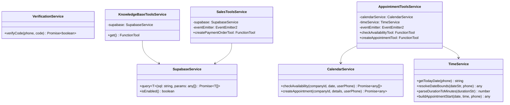

# Arquitectura de Tools (Herramientas Agénticas)

Este documento describe la arquitectura, patrones de diseño, validación en tiempo de ejecución, acceso al contexto de sesión e integración de infraestructura de las **Tools (Herramientas)** en el sistema agéntico de Optus.

---

## 1. Principios de Diseño de Herramientas

Las herramientas permiten a los modelos de lenguaje (LLM) interactuar de forma determinista con sistemas externos (bases de datos PostgreSQL, APIs de Google Calendar, servicios de verificación y canales de eventos).

```mermaid
flowchart TD
    LLM[Agente / Subagente LLM] -->|Invoca con argumentos JSON| ToolEntry[FunctionTool.execute(args, context)]
    
    subgraph Capa de Validación y Contexto
        ToolEntry --> ZodVal[Validación de Esquema Zod\nValidación y tipado de argumentos]
        ToolEntry --> CtxExtract[Extracción de Contexto ToolContext\napp:companyId, user:phone, user:role]
    end

    subgraph Observabilidad Reactiva
        CtxExtract --> EventEmitter[EventEmitter2 Central\nCanal system.notification]
        EventEmitter --> EventTriggered[TOOL_ACTION_TRIGGERED]
    end

    subgraph Capa de Ejecución y Servicios
        CtxExtract --> SvcRouter{Servicio Destino}
        SvcRouter --> SupabaseSvc[SupabaseService\nConsultas SQL / RPC RAG / Órdenes]
        SvcRouter --> CalSvc[CalendarService\nGoogle Calendar API v3]
        SvcRouter --> TimeSvc[TimeService\nCálculo de fechas y Timezones]
        SvcRouter --> VerifySvc[VerificationService\nValidación OTP]
    end

    subgraph Eventos de Dominio
        SupabaseSvc --> EventOrder[SALES_ORDER_REGISTERED]
        CalSvc --> EventAppt[APPOINTMENT_CREATED]
    end

    SvcRouter --> ReturnPayload[Contrato de Respuesta JSON\nsuccess, message, payload]
    ReturnPayload --> LLM
```

---

## 2. Componentes Clave de la Arquitectura de Tools

### 2.1. Clase `FunctionTool` de Google ADK
Cada herramienta se expone como una instancia de `FunctionTool` configurada con:
- `name`: Nombre único snake_case que identifica la función ante el modelo de IA.
- `description`: Instrucción en lenguaje natural que detalla cuándo, por qué y cómo el LLM debe utilizar la herramienta.
- `parameters`: Esquema Zod (`z.object({...})`) con descripciones por campo.
- `execute`: Función asíncrona que recibe los argumentos tipados `args` y el `ToolContext` de ejecución.

### 2.2. Encapsulamiento en Servicios NestJS (`@Injectable`)
Las herramientas no se definen como funciones globales sueltas, sino como propiedades de servicios `@Injectable()` registrados en el contenedor de inversión de control (IoC) de NestJS.

Esto permite:
- Inyección de dependencias de servicios de infraestructura (`SupabaseService`, `CalendarService`, `TimeService`, `VerificationService`, `EventEmitter2`).
- Reutilización y agrupación lógica de herramientas (`clientTools`, `adminTools`, `allTools`).
- Facilidad para crear pruebas unitarias e integración con mocks.

```typescript
@Injectable()
export class AppointmentToolsService {
  constructor(
    private readonly calendarService: CalendarService,
    private readonly timeService: TimeService,
    private readonly eventEmitter: EventEmitter2,
  ) {}

  get checkAvailabilityTool(): FunctionTool {
    return new FunctionTool({
      name: 'check_availability',
      description: 'Consulta los horarios disponibles para agendar una cita...',
      parameters: z.object({ ... }),
      execute: async (args, context?: ToolContext) => { ... },
    });
  }
}
```

---

## 3. Acceso al Estado de Sesión mediante `ToolContext`

El `ToolContext` provisto por Google ADK otorga acceso al almacén de estado en tiempo de ejecución (`context.state`).

### 3.1. Extracción Segura de Parámetros Multi-Tenant
Para garantizar el aislamiento de datos, las herramientas nunca confían en que el usuario proporcione su propio `companyId` o rol. Estos valores se extraen directamente del estado verificado de la sesión:

```typescript
const state = context?.state;
const companyId = state?.get('app:companyId') as string;
const userPhone = state?.get('user:phone') as string;
const userRole = state?.get('user:role') as string;
const userName = state?.get('user:name') as string | undefined;
```

### 3.2. Claves de Estado Estándar Utilizadas por las Tools

| Clave | Tipo | Utilizado por | Propósito |
| :--- | :--- | :--- | :--- |
| `app:companyId` | `string` (UUID) | Todas las herramientas | Aislamiento multi-tenant en SQL y Google Calendar |
| `user:phone` | `string` | Citas, Pagos, Verificación | Identificador del cliente / emisor |
| `user:role` | `string` | Reportes, Admin Tools | Validación estricta de permisos |
| `app:timezone` | `string` | Citas, Tiempo | Conversión precisa de horarios |
| `app:currency` | `string` | Ventas, Reportes | Moneda base para órdenes y métricas |

---

## 4. Validación de Esquemas en Tiempo de Ejecución con Zod

El LLM infiere los parámetros requeridos a partir de los esquemas Zod y sus metadatos `.describe()`:

```typescript
const searchCompanyInformationSchema = z.object({
  query: z
    .string()
    .trim()
    .min(1)
    .describe('Consulta breve con palabras clave para buscar información pública de la empresa.'),
});
```

### Ventajas:
1. **Validación Estricta**: Si el LLM pasa un tipo incorrecto o argumento vacío, Zod rechaza la llamada antes de que toque la base de datos.
2. **Generación Automática de Documentación**: Google ADK transforma el esquema Zod al formato JSON Schema que Gemini interpreta nativamente en su capa de Function Calling.

---

## 5. Emisión Reactiva de Eventos del Sistema

Todas las herramientas notifican sus acciones a la capa de eventos de NestJS mediante `EventEmitter2`.

### 5.1. Evento de Invocación de Tool (`TOOL_ACTION_TRIGGERED`)
Cada vez que una tool se ejecuta, se emite una notificación al canal `SYSTEM_EVENT_CHANNEL` (`system.notification`):

```typescript
private emitToolTriggered(companyId: string | undefined, toolName: string): void {
  if (!companyId) return;

  this.eventEmitter.emit(SYSTEM_EVENT_CHANNEL, {
    companyId,
    type: SystemEventType.TOOL_ACTION_TRIGGERED,
    timestamp: new Date().toISOString(),
    payload: { toolName },
  });
}
```

### 5.2. Eventos Específicos de Negocio
Determinadas herramientas generan eventos de alto nivel que disparan flujos asíncronos y Server-Sent Events (SSE):

- **`create_appointment`**: Emite `SystemEventType.APPOINTMENT_CREATED` con `appointmentId`, `date`, `time` y `durationMinutes`.
- **`create_payment_order`**: Emite `SystemEventType.SALES_ORDER_REGISTERED` con `orderId` y `amount`.

---

## 6. Integración con Servicios de Infraestructura



### 6.1. Búsqueda RAG en Base de Datos PostgreSQL
La herramienta `search_company_information` invoca la función RPC de PostgreSQL `public.search_public_knowledge`:
```sql
SELECT entity_name, data FROM public.search_public_knowledge($1::uuid, $2::text);
```
Esto ejecuta búsqueda de texto completo (`tsvector` / `tsquery`) filtrada estrictamente por el `company_id` del tenant.

### 6.2. Google Calendar API con Manejo Inteligente de Fechas
`AppointmentToolsService` utiliza `TimeService` para:
- Interpretar expresiones relativas ("mañana", "próximo lunes", "en 2 horas").
- Convertir horas a la zona horaria del usuario según su prefijo telefónico.
- Invocar la API de Google Calendar v3 usando las credenciales OAuth específicas del tenant.

---

## 7. Contrato Estándar de Retorno de Herramientas

Para que el modelo de lenguaje pueda razonar sobre el resultado y explicarlo al usuario con precisión, todas las herramientas devuelven un objeto JSON con la siguiente estructura base:

```typescript
interface ToolExecutionResult<T = Record<string, unknown>> {
  success: boolean;
  message: string;
  error?: string;
  [key: string]: unknown; // Datos específicos del dominio (events, orderId, results, etc.)
}
```

### Ejemplo de Retorno Exitoso (`check_availability`):
```json
{
  "success": true,
  "date": "2026-08-19",
  "events": [
    {
      "start": "2026-08-19T10:00:00-04:00",
      "end": "2026-08-19T11:00:00-04:00",
      "summary": "Cita con Carlos"
    }
  ],
  "message": "Encontré estos eventos para 2026-08-19: Cita con Carlos"
}
```

### Ejemplo de Retorno con Fallo Seguro (`search_company_information`):
```json
{
  "success": true,
  "message": "No se encontró información pública relacionada en la base de datos.",
  "results": []
}
```
Esto previene que el LLM sufra excepciones no controladas y le permite comunicar amablemente la indisponibilidad de la información al usuario.
