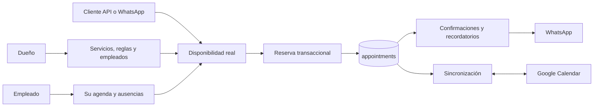
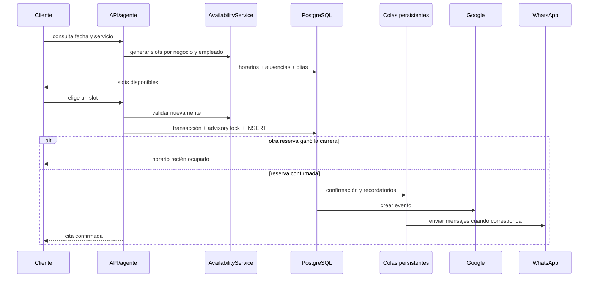

# Backend operativo de citas, empleados y clientes

Fecha: 2026-08-20

## Alcance completado

El backend ya cubre el ciclo operativo de una agenda para una empresa con dueño, empleados y clientes. PostgreSQL es la fuente de verdad; Google Calendar es una proyección sincronizada y WhatsApp es un canal de interacción y notificación.



### Dueño o administrador

- Configura zona horaria, horario del negocio, intervalo de slots, buffer, anticipación mínima/máxima, ventana de cancelación y recordatorios.
- Crea y actualiza servicios reservables, duración, precio y capacidad informativa.
- Crea empleados, asigna servicios, horarios semanales, vacaciones y ausencias.
- Registra calendarios de Google y los asigna a empleados.
- Ve todas las citas, fuerza sincronización, revisa conflictos y desconecta Google.
- Puede confirmar, completar, cancelar, reprogramar o marcar `no_show`.

### Empleado

- Ve únicamente las citas que tiene asignadas.
- Administra su propio horario semanal y sus ausencias.
- Puede modificar el estado o gestionar solamente sus propias citas.
- Recibe una notificación cuando se le asigna una cita si tiene teléfono.

### Cliente

- Consulta slots disponibles, no rangos ocupados internos.
- Crea citas exclusivamente para su teléfono autenticado/verificado.
- Lista, cancela y reprograma solamente sus propias citas.
- Debe respetar la anticipación mínima y la ventana de cancelación.
- Puede cancelar o reprogramar desde el agente aun sin conocer el UUID, indicando fecha y hora.
- Recibe confirmación, recordatorios y avisos de cambio/cancelación.

## Flujo de una reserva



La restricción de exclusión de PostgreSQL evita dos citas activas solapadas para el mismo empleado. El advisory lock aplica además el buffer configurado dentro de una misma transacción.

## Migración necesaria

Ejecutar en este orden:

1. `sql/calendar_sync_migration.sql`
2. `sql/calendar_sync_hardening.sql`
3. `sql/calendar_operational_completion.sql`

La tercera migración agrega asignación empleado-servicio, horarios, ausencias, auditoría, notificaciones, cola de sincronización y protección DB contra solapamientos. Antes de crear esa protección comprueba que no existan solapamientos antiguos.

## Endpoints nuevos o ampliados

Todos requieren autenticación, salvo el webhook firmado/validado de Google.

| Endpoint | Uso |
|---|---|
| `GET /v1/calendar/availability?date=YYYY-MM-DD&serviceId=...` | Slots reales disponibles |
| `POST /v1/calendar/appointments` | Crear una cita |
| `GET /v1/calendar/appointments` | Lista según alcance del actor |
| `PATCH /v1/calendar/appointments/:id/reschedule` | Reprogramar |
| `POST /v1/calendar/appointments/:id/cancel` | Cancelar |
| `PATCH /v1/calendar/appointments/:id/status` | Confirmar/completar/no-show |
| `GET/PUT /v1/calendar/admin/settings` | Reglas de reserva |
| `GET/POST/PATCH /v1/calendar/admin/services` | Servicios reservables |
| `GET/POST/PATCH /v1/calendar/admin/staff` | Empleados |
| `PUT /v1/calendar/admin/staff/:id/services` | Servicios del empleado |
| `GET/PUT /v1/calendar/admin/staff/:id/hours` | Horario semanal |
| `GET/POST/DELETE /v1/calendar/admin/...time-off` | Ausencias |
| `GET/POST /v1/calendar/admin/calendars` | Calendarios y asignación |
| `GET/DELETE /v1/calendar/admin/integration` | Estado o desconexión Google |

## Pruebas reales recomendadas

1. Crear dos empleados y un servicio de 30 minutos.
2. Asignar el servicio a ambos; configurar a uno de 09:00 a 12:00 y al otro de 14:00 a 18:00.
3. Crear una ausencia para el primer empleado de 10:00 a 11:00.
4. Consultar disponibilidad: no deben aparecer slots del primer empleado durante la ausencia.
5. Lanzar dos solicitudes simultáneas para el mismo empleado y slot: exactamente una debe ser aceptada.
6. Entrar como cliente A e intentar cancelar la cita del cliente B: debe responder `403`.
7. Entrar como empleado A e intentar modificar una cita de B: debe responder `403`.
8. Reprogramar una cita: deben cancelarse los recordatorios antiguos y crearse los nuevos.
9. Desactivar Internet o invalidar temporalmente OAuth y crear una cita: la cita debe persistir con error de sync.
10. Restaurar OAuth y ejecutar sync: debe aparecer en Google y pasar a `synced`.
11. Cambiar el evento en Google: el webhook debe crear un job persistente y reflejar el cambio en DB.
12. Marcar la cita `completed` o `no_show` y comprobar el registro en `appointment_audit_logs`.

Consultas de verificación:

```sql
SELECT id, status, sync_status, staff_id, scheduled_start, scheduled_end
FROM appointments ORDER BY created_at DESC LIMIT 20;

SELECT notification_type, status, scheduled_at, attempts, last_error
FROM appointment_notifications ORDER BY created_at DESC LIMIT 30;

SELECT job_type, status, attempts, last_error
FROM calendar_sync_jobs ORDER BY created_at DESC LIMIT 30;

SELECT action, actor_type, created_at
FROM appointment_audit_logs ORDER BY created_at DESC LIMIT 30;
```

## Límites conscientes

- `catalog_items.capacity` queda disponible para reportes/configuración, pero la capacidad operativa actual es una cita simultánea por empleado. Clases grupales requieren una extensión de cupos por evento.
- Las notificaciones usan WhatsApp; una empresa sin credenciales o número configurado acumulará reintentos/fallos visibles en la cola.
- El backend está completo para el ciclo de agenda. El panel web aún debe consumir estos endpoints para ofrecer toda la experiencia visual al dueño y al empleado.
