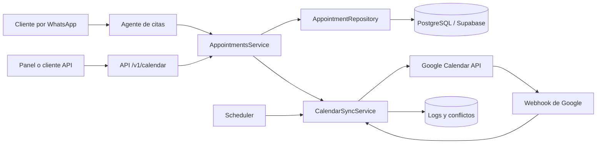
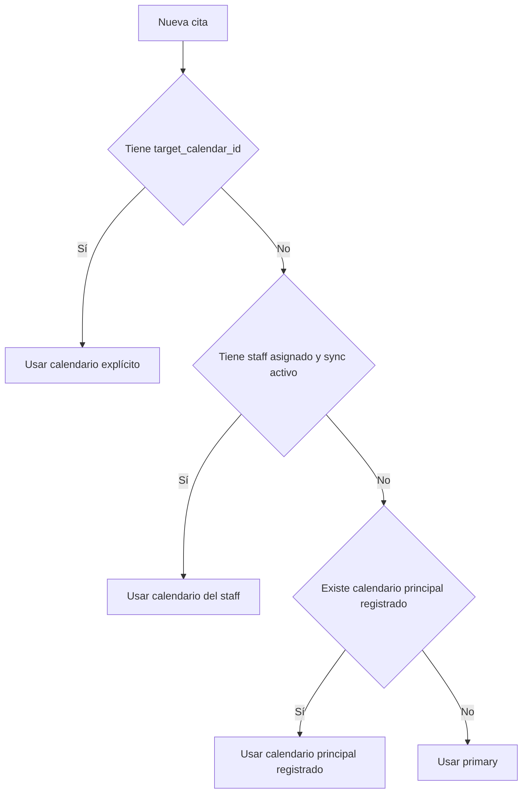
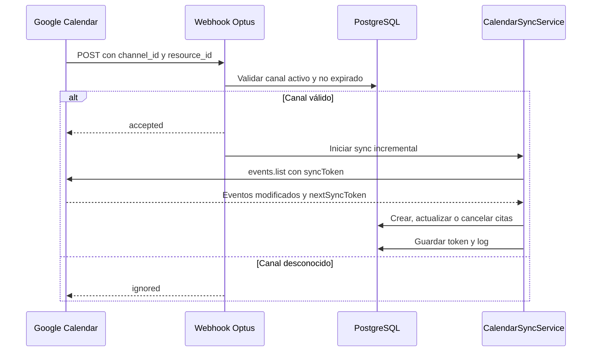

# Guía del sistema de Google Calendar y pruebas reales

Fecha: 2026-08-20  
Proyecto: Optus Agent Backend

## 1. Objetivo del sistema

El sistema mantiene sincronizadas las citas de Optus con uno o varios calendarios de Google.

La tabla `appointments` es la fuente de verdad. Esto significa que una cita se guarda primero en PostgreSQL y después se intenta reflejar en Google Calendar. Si Google está temporalmente caído, no hay conexión o se supera una cuota, la cita permanece guardada con `sync_status = 'error'` y puede reintentarse automáticamente.

El sistema soporta:

- Creación de citas desde la API o el agente de WhatsApp.
- Asignación automática de un trabajador disponible.
- Un calendario diferente para cada trabajador.
- Actualización, reprogramación y cancelación en ambos sentidos.
- Importación de eventos creados directamente en Google Calendar.
- Webhooks para enterarse rápidamente de cambios en Google.
- Sincronización incremental cada 15 minutos como respaldo.
- Sincronización completa diaria.
- Registro de operaciones, errores y conflictos.
- Resolución administrativa de conflictos.

## 2. Arquitectura general



La escritura normal sigue este orden:

```mermaid
sequenceDiagram
    participant U as Usuario o agente
    participant A as AppointmentsService
    participant DB as PostgreSQL
    participant S as CalendarSyncService
    participant G as Google Calendar

    U->>A: Crear cita
    A->>DB: Buscar staff disponible
    A->>DB: Verificar solapamientos
    A->>DB: INSERT appointment (pending)
    A->>S: Sincronizar appointment
    S->>DB: Resolver calendar_id
    S->>G: Crear evento
    alt Google responde correctamente
        G-->>S: event_id, link, updated
        S->>DB: Estado synced
        A-->>U: Cita creada y sincronizada
    else Google falla
        G--xS: Error de red, OAuth o cuota
        S->>DB: Estado error y mensaje
        A-->>U: Cita creada; sincronización pendiente
    end
```

## 3. Selección del calendario destino

Para cada cita se usa la siguiente prioridad:

1. `appointments.target_calendar_id`, si fue especificado explícitamente.
2. `company_staff.google_calendar_id`, si la cita tiene un trabajador asignado.
3. El calendario marcado como principal en `google_calendar_registry`.
4. El calendario `primary` de la cuenta Google conectada.



Cuando no se envía `staffId`, el repositorio busca el primer trabajador activo que no tenga una cita solapada. Da prioridad a los trabajadores que ya tienen un calendario de Google configurado.

## 4. Estados de sincronización

| Estado | Significado | Acción esperada |
|---|---|---|
| `pending` | La cita todavía debe enviarse a Google | El scheduler o un sync manual la procesará |
| `synced` | DB y Google quedaron sincronizados | No requiere acción |
| `error` | Google o la DB devolvieron un error | Revisar `sync_error_message`; se reintentará |
| `conflict` | DB y Google cambiaron casi simultáneamente | Resolver desde el endpoint administrativo |

Las citas nunca se eliminan de PostgreSQL al cancelar. Cambian a `status = 'cancelled'`, y el evento correspondiente se elimina de Google.

## 5. Sincronización desde Google hacia la DB

Google envía una notificación al webhook cuando cambia un calendario. La notificación no contiene el evento modificado; solo avisa que existe un cambio. Por eso el backend valida el canal y luego consulta la API de Google.



Los tokens incrementales se guardan por calendario en:

```text
company_integrations.sync_settings.sync_tokens
```

Si Google responde HTTP 410 porque un token expiró, el sistema elimina ese token en memoria y realiza una lectura sin token para recuperarse.

## 6. Conflictos

Existe un conflicto cuando la cita en DB y su evento en Google cambiaron después de la última sincronización.

- Si Google fue modificado más de cinco minutos después que la DB, gana Google.
- Si la DB fue modificada más de cinco minutos después que Google, gana la DB.
- Si la diferencia es menor o igual a cinco minutos, la cita queda en `conflict` y se registra un snapshot de ambos estados.

Un administrador puede resolverlo con una de estas estrategias:

- `google_wins`: copia el estado de Google a la DB.
- `db_wins`: vuelve a enviar el estado de la DB a Google.
- `ignore`: conserva el estado actual y cierra el conflicto.

## 7. Archivos agregados y modificados

### Archivos nuevos

| Archivo | Responsabilidad |
|---|---|
| `src/features/calendar/calendar.types.ts` | Tipos compartidos de citas, integraciones, eventos y resúmenes de sincronización |
| `src/features/calendar/appointment.repository.ts` | Consultas SQL, clientes, staff disponible, solapamientos y persistencia de citas |
| `src/features/calendar/appointments.service.ts` | Casos de uso: crear, cancelar, reprogramar, listar y consultar disponibilidad |
| `src/features/calendar/calendar-sync.service.ts` | Orquestación DB→Google, Google→DB, tokens, conflictos y full sync |
| `src/features/calendar/calendar-sync-log.service.ts` | Inicio y cierre de registros en `calendar_sync_logs` |
| `src/features/calendar/calendar-sync.scheduler.ts` | Sync cada 15 minutos, full sync diario y renovación de webhooks |
| `src/features/calendar/calendar.controller.ts` | Endpoints autenticados para citas, conexión, sync, estado y conflictos |
| `src/features/calendar/google-calendar-webhook.service.ts` | Alta, renovación, detención y validación de canales Google |
| `src/features/calendar/google-calendar-webhook.controller.ts` | Endpoint público que recibe notificaciones de Google |
| `src/features/calendar/dto/calendar.dto.ts` | Validación de cuerpos y parámetros HTTP |
| `src/features/calendar/appointments.service.spec.ts` | Pruebas del flujo DB-first, solapamientos y reprogramación |
| `src/features/calendar/calendar-sync.service.spec.ts` | Pruebas de creación, cancelación, errores y conflictos |
| `sql/calendar_sync_hardening.sql` | Corrección multi-calendario, tabla de webhooks y políticas RLS |

### Archivos modificados

| Archivo | Cambio |
|---|---|
| `src/features/calendar/calendar.service.ts` | Cliente Google para listar, crear, modificar, eliminar y observar eventos |
| `src/features/calendar/calendar.module.ts` | Registro de controladores, servicios, scheduler y autenticación |
| `src/core/adk/agents/general/appointment/appointment.tools.ts` | Reemplazo de respuestas simuladas por operaciones reales en DB |
| `src/features/auth/oauth.service.ts` | Corrección OAuth, formato único de tokens y persistencia al renovar |
| `src/features/auth/auth.module.ts` | Exportación de OAuth para el módulo de calendario y agentes |
| `sql/calendar_sync_migration.sql` | Migración repetible y unicidad correcta por calendario |
| `.env.example` | Variable pública HTTPS del webhook |
| `package.json` | Dependencia `@nestjs/schedule` |

El archivo antiguo `google-calendar.service.ts` fue eliminado porque duplicaba el cliente Google y utilizaba variables y un formato de credenciales incompatibles.

## 8. Endpoints disponibles

Todos los endpoints de `/v1/calendar`, excepto el webhook de Google, requieren la cookie HTTP-only `optus_auth` de una sesión completa.

| Método | Ruta | Función | Rol |
|---|---|---|---|
| GET | `/v1/calendar/connect` | Iniciar OAuth de Google Calendar | Admin/owner |
| POST | `/v1/calendar/appointments` | Crear una cita | Usuario autenticado |
| GET | `/v1/calendar/appointments` | Listar citas por teléfono | Usuario autenticado |
| GET | `/v1/calendar/availability` | Consultar ocupación de un rango | Usuario autenticado |
| PATCH | `/v1/calendar/appointments/:id/reschedule` | Reprogramar | Usuario autenticado |
| POST | `/v1/calendar/appointments/:id/cancel` | Cancelar | Usuario autenticado |
| POST | `/v1/calendar/sync` | Ejecutar full sync bidireccional | Admin/owner |
| POST | `/v1/calendar/webhooks/setup` | Crear webhooks para calendarios activos | Admin/owner |
| GET | `/v1/calendar/status` | Salud, logs y conflictos | Admin/owner |
| POST | `/v1/calendar/conflicts/:id/resolve` | Resolver un conflicto | Admin/owner |
| POST | `/v1/webhooks/google-calendar` | Recibir notificaciones Google | Público, validado por canal/recurso |

## 9. Preparación para pruebas reales

### 9.1 Base de datos

Si la migración principal ya fue aplicada, ejecutar solamente:

```sql
-- En Supabase SQL Editor
-- Contenido de sql/calendar_sync_hardening.sql
```

Verificar las tablas:

```sql
SELECT to_regclass('public.calendar_sync_logs') AS logs,
       to_regclass('public.calendar_sync_conflicts') AS conflicts,
       to_regclass('public.google_calendar_registry') AS registry,
       to_regclass('public.google_calendar_webhook_channels') AS webhooks;
```

Las cuatro columnas deben devolver el nombre de la tabla, no `NULL`.

### 9.2 Variables de entorno

Configurar como mínimo:

```dotenv
SUPABASE_DB_URL='postgresql://...'
GOOGLE_OAUTH_CLIENT_ID='...apps.googleusercontent.com'
GOOGLE_OAUTH_CLIENT_SECRET='...'
ENCRYPTION_KEY='una-clave-larga-unica-y-segura'
MAIN_PAGE_URL='https://api.tu-dominio.com'
FRONTEND_DASHBOARD_URL='https://tu-frontend.com/dashboard'
GOOGLE_CALENDAR_WEBHOOK_URL='https://api.tu-dominio.com/v1/webhooks/google-calendar'
TIMEZONE_FALLBACK='America/La_Paz'
```

Google no acepta `localhost` para notificaciones push reales. La URL del webhook debe ser HTTPS, pública y apuntar al endpoint exacto.

El callback que se debe registrar en Google Cloud es:

```text
https://api.tu-dominio.com/v1/auth/google/callback
```

### 9.3 Google Cloud

1. Habilitar Google Calendar API.
2. Crear credenciales OAuth 2.0 de tipo aplicación web.
3. Registrar el callback anterior como URI autorizada.
4. Configurar la pantalla de consentimiento.
5. Agregar las cuentas de prueba si la aplicación sigue en modo Testing.

### 9.4 Registrar calendarios

Primero identificar la empresa y los trabajadores:

```sql
SELECT id, name FROM companies ORDER BY created_at DESC;

SELECT id, first_name, last_name, google_calendar_id,
       calendar_sync_enabled
FROM company_staff
WHERE company_id = '<COMPANY_ID>';
```

Registrar el calendario principal:

```sql
INSERT INTO google_calendar_registry (
  company_id, calendar_id, calendar_name, calendar_type,
  is_primary, is_active
) VALUES (
  '<COMPANY_ID>', 'primary', 'Agenda principal', 'primary',
  TRUE, TRUE
)
ON CONFLICT (company_id, calendar_id) DO UPDATE
SET calendar_name = EXCLUDED.calendar_name,
    is_primary = TRUE,
    is_active = TRUE;
```

Para un trabajador con calendario secundario:

```sql
INSERT INTO google_calendar_registry (
  company_id, calendar_id, calendar_name, calendar_type,
  assigned_to_staff_id, is_primary, is_active
) VALUES (
  '<COMPANY_ID>', '<CALENDAR_ID_GOOGLE>', 'Agenda de Ana', 'secondary',
  '<STAFF_ID>', FALSE, TRUE
)
ON CONFLICT (company_id, calendar_id) DO UPDATE
SET assigned_to_staff_id = EXCLUDED.assigned_to_staff_id,
    is_active = TRUE;

UPDATE company_staff
SET google_calendar_id = '<CALENDAR_ID_GOOGLE>',
    google_calendar_name = 'Agenda de Ana',
    calendar_sync_enabled = TRUE
WHERE id = '<STAFF_ID>' AND company_id = '<COMPANY_ID>';
```

## 10. Plan de pruebas reales

### Prueba 1: iniciar el backend

```powershell
cd E:\UMSA\Optus\optus-agentBE
npm.cmd install
npm.cmd run build
npm.cmd start
```

Resultado esperado:

- El proceso muestra `Nest application successfully started`.
- Swagger está disponible en `https://api.tu-dominio.com/docs` o en el puerto local configurado.
- Aparecen las rutas `/v1/calendar` y `/v1/webhooks/google-calendar`.

### Prueba 2: conectar Google

1. Iniciar sesión normalmente en Optus hasta obtener la cookie `optus_auth` completa.
2. Abrir en el mismo navegador:

```text
https://api.tu-dominio.com/v1/calendar/connect
```

3. Autorizar el acceso a Google Calendar.

Resultado esperado en DB:

```sql
SELECT company_id, provider, is_active, sync_enabled,
       encrypted_credentials <> '{}'::jsonb AS has_credentials
FROM company_integrations
WHERE company_id = '<COMPANY_ID>'
  AND provider = 'GOOGLE_CALENDAR';
```

Debe existir una fila activa con `has_credentials = true`. Nunca se deben ver tokens en texto plano.

### Prueba 3: configurar webhooks

Desde Swagger, Postman o el frontend, conservando la cookie:

```http
POST /v1/calendar/webhooks/setup
```

Resultado esperado:

```json
{
  "configured": 1
}
```

El número será mayor si existen calendarios secundarios.

Verificar:

```sql
SELECT company_id, calendar_id, channel_id, resource_id,
       expiration, is_active
FROM google_calendar_webhook_channels
WHERE company_id = '<COMPANY_ID>'
ORDER BY calendar_id;
```

Debe existir un canal activo y no expirado por cada calendario registrado.

### Prueba 4: crear una cita desde la API

Petición de ejemplo:

```http
POST /v1/calendar/appointments
Content-Type: application/json
Cookie: optus_auth=<COOKIE_DE_SESION>

{
  "title": "Prueba real de calendario",
  "start": "2026-08-25T14:00:00.000-04:00",
  "end": "2026-08-25T14:30:00.000-04:00",
  "description": "Creada desde la API de Optus",
  "customerPhone": "+59170000000",
  "customerName": "Cliente Prueba"
}
```

Resultado esperado:

- HTTP 201.
- La respuesta contiene un UUID en `id`.
- `staff_id` contiene el trabajador asignado, si había uno disponible.
- `sync_status` normalmente será `synced`.
- `google_calendar_event_id` y `google_calendar_link` tendrán valor.
- El evento aparecerá en el calendario del staff asignado o en el principal.

Verificar en DB:

```sql
SELECT id, staff_id, title, scheduled_start, scheduled_end, status,
       target_calendar_id, google_calendar_event_id,
       sync_status, sync_error_message, last_synced_at
FROM appointments
WHERE title = 'Prueba real de calendario'
ORDER BY created_at DESC
LIMIT 1;
```

Si Google falla, la API conserva la cita y devuelve `sync_status = 'error'`. Esto es comportamiento esperado de tolerancia a fallos.

### Prueba 5: impedir un solapamiento

Repetir la creación con un rango que se cruce con la cita anterior y el mismo `staffId`.

Resultado esperado:

- HTTP 400.
- Mensaje: `El horario solicitado ya está ocupado`.
- No debe insertarse una segunda cita.

### Prueba 6: reprogramar

```http
PATCH /v1/calendar/appointments/<APPOINTMENT_ID>/reschedule
Content-Type: application/json
Cookie: optus_auth=<COOKIE_DE_SESION>

{
  "start": "2026-08-25T15:00:00.000-04:00",
  "end": "2026-08-25T15:30:00.000-04:00"
}
```

Resultado esperado:

- Cambian las fechas en PostgreSQL.
- Se modifica el mismo evento de Google; no se crea un duplicado.
- `google_calendar_event_id` permanece igual.
- `sync_status` vuelve a `synced`.

### Prueba 7: cancelar

```http
POST /v1/calendar/appointments/<APPOINTMENT_ID>/cancel
Content-Type: application/json
Cookie: optus_auth=<COOKIE_DE_SESION>

{
  "reason": "Prueba de cancelación"
}
```

Resultado esperado:

- La cita permanece en DB con `status = 'cancelled'`.
- El evento deja de aparecer como activo en Google.
- La cita termina con `sync_status = 'synced'`.

### Prueba 8: cambio creado en Google

1. Crear manualmente un evento en el calendario registrado.
2. Esperar unos segundos al webhook.
3. Consultar:

```sql
SELECT id, title, source, target_calendar_id,
       google_calendar_event_id, sync_status
FROM appointments
WHERE source = 'google_calendar'
ORDER BY created_at DESC
LIMIT 10;
```

Resultado esperado:

- Aparece una cita con `source = 'google_calendar'`.
- `target_calendar_id` identifica el calendario donde se creó.
- Si el calendario estaba asignado a un staff, la cita contiene ese `staff_id`.

Modificar y luego eliminar el evento en Google. Cada cambio debe reflejarse en la misma fila; al eliminarlo, el estado debe ser `cancelled`.

Si el webhook todavía no funciona, ejecutar manualmente:

```http
POST /v1/calendar/sync
Cookie: optus_auth=<COOKIE_ADMIN>
```

### Prueba 9: revisar salud y logs

```http
GET /v1/calendar/status
Cookie: optus_auth=<COOKIE_ADMIN>
```

La respuesta contiene:

- `health`: cantidades synced, pending, error y conflict.
- `logs`: últimas operaciones, duración y errores.
- `conflicts`: conflictos todavía pendientes.

Consulta SQL equivalente:

```sql
SELECT * FROM v_company_sync_health
WHERE company_id = '<COMPANY_ID>';

SELECT sync_type, sync_direction, status, events_processed,
       events_created, events_updated, events_deleted,
       errors_count, error_details, created_at
FROM calendar_sync_logs
WHERE company_id = '<COMPANY_ID>'
ORDER BY created_at DESC
LIMIT 20;
```

### Prueba 10: provocar y resolver un conflicto

1. Sincronizar una cita normalmente.
2. Modificar la cita directamente en DB.
3. Antes de volver a sincronizar, modificar también el evento en Google con menos de cinco minutos de diferencia.
4. Ejecutar `POST /v1/calendar/sync` si el webhook no lo procesa inmediatamente.

La cita debe quedar con `sync_status = 'conflict'` y aparecer en `/v1/calendar/status`.

Resolver usando Google:

```http
POST /v1/calendar/conflicts/<CONFLICT_ID>/resolve
Content-Type: application/json
Cookie: optus_auth=<COOKIE_ADMIN>

{
  "strategy": "google_wins",
  "notes": "Validado durante prueba E2E"
}
```

También se puede usar `db_wins` o `ignore`.

## 11. Pruebas desde el agente de WhatsApp

Con una empresa que tenga Google conectado, enviar mensajes como:

```text
Quiero una cita para el 25 de agosto a las 14:00 por 30 minutos.
```

Después probar:

```text
Muéstrame mis próximas citas.
Reprograma la cita <UUID> para el 25 de agosto a las 15:00.
Cancela la cita <UUID> porque no podré asistir.
```

Resultados esperados:

- El agente devuelve el UUID real de `appointments`, no un ID simulado.
- La cita se puede consultar por el teléfono del remitente.
- La creación aparece en Google.
- Reprogramar conserva la duración original.
- Cancelar modifica la DB y elimina el evento externo.

## 12. Verificación automatizada local

```powershell
cd E:\UMSA\Optus\optus-agentBE
npm.cmd test -- --runInBand
npm.cmd run build
npx.cmd eslint "src/features/calendar/**/*.ts"
```

Actualmente deben aprobarse tres suites y nueve pruebas.

Las pruebas unitarias no contactan Google ni Supabase. Para validar credenciales, webhooks, zonas horarias y permisos se deben ejecutar las pruebas reales de las secciones anteriores.

## 13. Problemas frecuentes

### `Google Calendar not connected`

- Confirmar la fila `GOOGLE_CALENDAR` en `company_integrations`.
- Repetir `/v1/calendar/connect`.
- Verificar que la cuenta OAuth corresponde a la empresa autenticada.

### La cita queda en `error`

Consultar:

```sql
SELECT id, sync_error_message
FROM appointments
WHERE sync_status = 'error'
ORDER BY db_updated_at DESC;
```

Corregir credenciales, permisos o conectividad y ejecutar `/v1/calendar/sync`.

### El webhook devuelve `ignored`

- Revisar que el canal exista y esté activo.
- Comparar `x-goog-channel-id` y `x-goog-resource-id` con la DB.
- Confirmar que `expiration > NOW()`.
- Volver a ejecutar `/v1/calendar/webhooks/setup`.

### El evento aparece en el calendario equivocado

Revisar en este orden:

```sql
SELECT target_calendar_id, staff_id
FROM appointments WHERE id = '<APPOINTMENT_ID>';

SELECT google_calendar_id, calendar_sync_enabled
FROM company_staff WHERE id = '<STAFF_ID>';

SELECT calendar_id, is_primary, is_active
FROM google_calendar_registry
WHERE company_id = '<COMPANY_ID>';
```

### El backend no conecta a Supabase

- Verificar que el hostname de `SUPABASE_DB_URL` resuelva por DNS.
- Confirmar que el proyecto Supabase no esté pausado.
- Revisar contraseña, puerto, SSL y restricciones de red.

### Google no entrega `refresh_token`

El sistema conserva el refresh token anterior. Para una primera conexión, revocar el acceso anterior desde la cuenta Google y repetir OAuth con `prompt=consent`.

## 14. Criterio de aceptación final

La integración se considera validada cuando se cumplen todos estos puntos:

- Una cita de Optus aparece una sola vez en el calendario correcto.
- Una modificación conserva el mismo `google_calendar_event_id`.
- Una cancelación deja registro en DB y elimina el evento activo.
- Un evento creado, modificado o cancelado en Google se refleja en DB.
- Los webhooks existen para todos los calendarios activos.
- El scheduler recupera cambios aunque un webhook se pierda.
- Los errores quedan registrados sin perder citas.
- Los conflictos pueden consultarse y resolverse.
- No se guardan tokens OAuth en texto plano.
- `npm test`, `npm run build` y ESLint finalizan correctamente.

