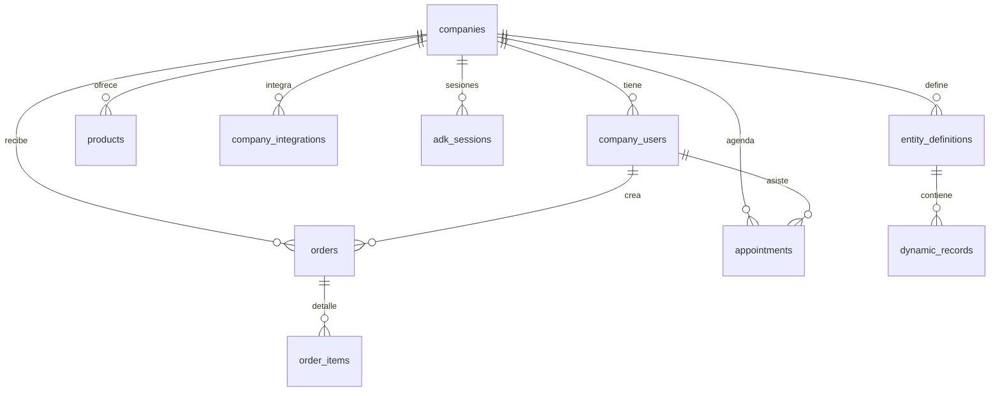
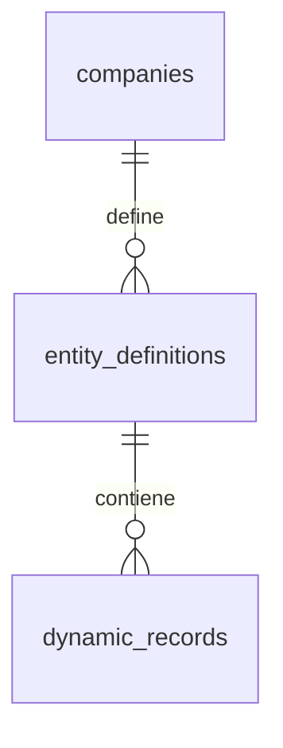

# Esquema de Base de Datos

PostgreSQL (Supabase) con aislamiento por `company_id`. Puerto 6543 (pgbouncer).

---

## Diagrama de Relaciones

---

## Tablas Principales

### `companies`

Datos de cada empresa en el sistema multi-tenant.

| Campo                          | Tipo        | Descripción                                          |
|--------------------------------|-------------|------------------------------------------------------|
| `id`                           | UUID        | PK                                                   |
| `name`                         | TEXT        | Nombre de la empresa                                 |
| `whatsapp_phone_id`            | TEXT UNIQUE | Phone number ID de Meta (ej: `123456789012345`)     |
| `whatsapp_display_phone_number`| TEXT        | Número legible (ej: `+591 77242197`)                 |
| `whatsapp_admin_phone_ids`     | TEXT[]      | Números de admins (MSISDNs sin +)                    |
| `config`                       | JSONB       | Configuración: perfil, horarios, límites             |
| `created_at`, `updated_at`     | TIMESTAMPTZ | Timestamps                                           |

### `company_users`

Usuarios (admins y clientes) por empresa.

| Campo         | Tipo        | Descripción                              |
|---------------|-------------|------------------------------------------|
| `id`          | UUID        | PK                                       |
| `company_id`  | UUID        | FK → companies                           |
| `phone`       | TEXT        | MSISDN sin + (ej: `59177242197`)         |
| `name`        | TEXT        | Nombre del usuario                       |
| `role`        | ENUM        | `ADMIN` o `CLIENT`                       |
| `embedding`   | VECTOR      | pgvector (memoria semántica futura)      |

**Constraint:** UNIQUE(`company_id`, `phone`)

### `company_integrations`

Credenciales encriptadas para servicios externos.

| Campo                  | Tipo        | Descripción                                |
|------------------------|-------------|--------------------------------------------|
| `id`                   | UUID        | PK                                         |
| `company_id`           | UUID        | FK → companies                             |
| `provider`             | ENUM        | `GOOGLE_CALENDAR`, `CIRCLE_USDC`, etc      |
| `encrypted_credentials`| JSONB       | Tokens OAuth/API keys (AES-256)            |
| `needs_2fa_attention`  | BOOLEAN     | Flag para alertas                          |
| `updated_at`           | TIMESTAMPTZ | Última actualización                       |

### `products`

Catálogo de productos por empresa.

| Campo           | Tipo        | Descripción                     |
|-----------------|-------------|---------------------------------|
| `id`            | UUID        | PK                              |
| `company_id`    | UUID        | FK → companies                  |
| `sku`           | TEXT        | Código único                    |
| `name`          | TEXT        | Nombre del producto             |
| `description`   | TEXT        | Descripción                     |
| `price`         | NUMERIC     | Precio en moneda local          |
| `stock_quantity`| INTEGER     | Stock disponible                |
| `image_url`     | TEXT        | URL de imagen                   |
| `meta_catalog_id`| TEXT       | ID en Meta Business Catalog     |

**Index:** Full-text search sobre `name` y `description`

### `orders`

Órdenes de compra con estados de pago.

| Campo       | Tipo        | Descripción                                  |
|-------------|-------------|----------------------------------------------|
| `id`        | UUID        | PK                                           |
| `company_id`| UUID        | FK → companies                               |
| `user_id`   | UUID        | FK → company_users                           |
| `status`    | ENUM        | `CART`, `PENDING_PAYMENT`, `PAID`, `COMPLETED`, `FAILED` |
| `total`     | NUMERIC     | Total de la orden                            |
| `details`   | TEXT        | Referencia de pago                           |
| `metadata`  | JSONB       | Circle payment_intent_id, etc                |

### `order_items`

Detalle de productos en cada orden.

| Campo        | Tipo    | Descripción          |
|--------------|---------|----------------------|
| `id`         | UUID    | PK                   |
| `order_id`   | UUID    | FK → orders          |
| `product_id` | UUID    | FK → products        |
| `quantity`   | INTEGER | Cantidad             |
| `unit_price` | NUMERIC | Precio al momento    |

### `appointments`

Citas agendadas con sincronización a Google Calendar.

| Campo              | Tipo        | Descripción                                  |
|--------------------|-------------|----------------------------------------------|
| `id`               | UUID        | PK                                           |
| `company_id`       | UUID        | FK → companies                               |
| `user_id`          | UUID        | FK → company_users                           |
| `start_time`       | TIMESTAMPTZ | Inicio                                       |
| `end_time`         | TIMESTAMPTZ | Fin                                          |
| `status`           | ENUM        | `PENDING_SYNC`, `CONFIRMED`, `CANCELLED`, `COMPLETED` |
| `google_event_id`  | TEXT        | ID del evento en Calendar                    |
| `google_html_link` | TEXT        | Link directo al evento                       |

**Constraint:** UNIQUE(`company_id`, `start_time`, `end_time`) - evita traslapes

### `adk_sessions`

Sesiones de conversación del sistema ADK.

| Campo          | Tipo        | Descripción                                  |
|----------------|-------------|----------------------------------------------|
| `session_id`   | TEXT        | PK - formato `${companyId}:${userPhone}`     |
| `company_id`   | UUID        | FK → companies (indexado)                    |
| `context_data` | JSONB       | Historial + variables de contexto            |
| `created_at`   | TIMESTAMPTZ | Creación                                     |
| `updated_at`   | TIMESTAMPTZ | Última actualización                         |

**Variables de contexto inyectadas:**
- `app:companyName`, `app:companyConfig`
- `user:role`, `user:name`, `user:phone`

---

## Knowledge Base Dinámica (Universal Schema)

Sistema para datos estructurados dinámicos desde Google Sheets.

### `entity_definitions`

Define tipos de entidad (Horarios, Menús, Precios).

| Campo              | Tipo        | Descripción                                |
|--------------------|-------------|--------------------------------------------|
| `id`               | UUID        | PK                                         |
| `company_id`       | UUID        | FK → companies                             |
| `entity_name`      | TEXT        | Nombre (ej: "Horarios", "[PRIV] Costos")   |
| `schema_sample`    | JSONB       | Ejemplo de estructura                      |
| `is_public_default`| BOOLEAN     | Si `false`, IA no puede leer               |

**Privacidad:** Entidades con `[PRIV]` en nombre → `is_public_default = false`

### `dynamic_records`

Registros dinámicos en formato JSONB.

| Campo                  | Tipo        | Descripción                          |
|------------------------|-------------|--------------------------------------|
| `id`                   | UUID        | PK                                   |
| `company_id`           | UUID        | FK → companies                       |
| `entity_definition_id` | UUID        | FK → entity_definitions              |
| `external_row_id`      | TEXT        | ID de Google Sheets                  |
| `data`                 | JSONB       | Contenido flexible                   |
| `search_text`          | TSVECTOR    | Full-text search                     |

**Índices:**
- GIN sobre `data` (consultas JSONB rápidas)
- Compuesto `(company_id, entity_definition_id)`

### Sincronización (Google Sheets)

1. Add-on detecta cambios en hoja
2. POST `/sheets-sync` con datos + schema
3. Backend identifica privacidad según nombre hoja
4. Wipe & Replace en `dynamic_records`
5. Tool `query_dynamic_data` filtra solo datos públicos

---

## Reglas Importantes

1. **Aislamiento:** Siempre filtra por `company_id`
2. **Multi-tenant:** Identifica empresa por `whatsapp_phone_id` desde webhook Meta
3. **Roles:** Admin vs Client determinado por `company_users.role`
4. **ADK Sessions:** ID único `${companyId}:${userPhone}` para aislar conversaciones
5. **Privacidad:** Tool `query_dynamic_data` solo lee entidades con `is_public_default = true`
6. **RLS:** Habilitado en todas las tablas para seguridad adicional

---

**Última actualización**: Enero 2026  
**Motor**: PostgreSQL 15 + pgvector + pgbouncer
